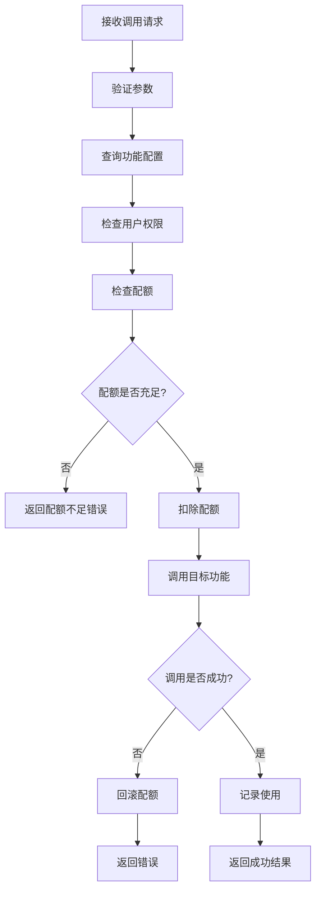

# 功能调用统一网关云函数

## 功能说明

统一的功能调用网关，**主要用于收费功能的调用**，负责：
1. **权限检查**：检查用户是否有权限使用该功能
2. **配额检查**：检查用户是否有足够的配额（仅收费功能）
3. **配额扣除**：调用前扣除配额（优先使用免费配额，仅收费功能）
4. **功能调用**：根据配置调用目标云函数
5. **使用记录**：记录每次功能使用
6. **配额回滚**：功能调用失败时自动回滚配额（仅收费功能）

### 免费功能说明

**免费功能（如 `GEN_BAZI`）不需要经过网关**，可以直接调用目标云函数：

```javascript
// 免费功能直接调用，不需要经过网关
wx.cloud.callFunction({
  name: 'cozeFunctions_v1_3',
  data: {
    workflowType: 'GEN_BAZI',
    parameters: {
      year: 2024,
      month: 1,
      day: 15,
      hour: 10,
      min: 30
    }
  }
});
```

**网关仍然支持免费功能**（如果确实需要通过网关调用）：
- ✅ 跳过配额检查和扣除
- ✅ 直接调用目标云函数
- ✅ 记录使用记录（isPaid=false）
- ✅ 功能调用失败时不回滚配额（因为没有扣除）

但**推荐免费功能直接调用目标云函数**，减少不必要的调用链。

## 核心流程



## 接口概览

### callFunction（统一调用接口）

统一的功能调用入口，自动处理权限检查、配额扣除、功能调用、使用记录等。

**请求参数：**
```javascript
{
  action: 'callFunction',
  data: {
    functionCode: 'wisdom_insight',  // 功能编码
    functionParams: {                 // 功能参数（可选）
      parameters: {
        question: '我应该换工作吗？'
      }
    }
  }
}
```

**返回数据：**
```javascript
{
  success: true,
  data: {
    functionResult: { /* 功能返回的结果 */ },
    quotaInfo: {
      before: { freeRemaining: 2, paidRemaining: 5 },
      after: { freeRemaining: 1, paidRemaining: 5 },
      isPaid: false
    }
  }
}
```

## 配额计算逻辑

### 免费功能
- **免费功能**（如 `GEN_BAZI`）：**不需要经过网关**，直接调用目标云函数
- **如果通过网关调用免费功能**，判断标准：
  - `functionType === 'free'`
  - `price === 0` 或未设置
  - 功能不在 `function_products` 表中

### 收费功能配额优先级
1. **优先使用免费配额**：每日免费配额用完后才使用付费配额
2. **配额扣除**：使用原子操作，保证并发安全
3. **配额回滚**：功能调用失败时自动回滚，确保用户权益

### 配额来源
- **免费配额**：从 `static_user_types` 表配置，每日重置
- **付费配额**：从 `function_quotas` 表查询，永久有效

## 功能配置

功能配置存储在 `function_products` 表中，包含：
- `callConfig.targetFunction`：目标云函数名称
- `callConfig.workflowType`：工作流类型（传递给目标云函数，网关会自动映射）
- `callConfig.parameters`：默认参数（与用户参数合并）

### 工作流类型映射

网关会自动将某些工作流类型映射为目标云函数支持的类型：
- `WISDOM_INSIGHT` → `DRAW_CARD`（智慧洞见和抽卡牌是同一个功能）

这样可以在数据库中使用更语义化的名称（如 `WISDOM_INSIGHT`），而实际调用时映射到目标云函数支持的类型。

## 错误处理

### 错误码
- `INVALID_PARAMS`：参数错误
- `FUNCTION_NOT_FOUND`：功能不存在或已下架
- `INVALID_CONFIG`：功能配置错误
- `PERMISSION_DENIED`：无权限
- `QUOTA_INSUFFICIENT`：配额不足
- `FUNCTION_CALL_FAILED`：功能调用失败
- `INTERNAL_ERROR`：内部错误

### 配额回滚机制
- 功能调用失败时，自动回滚已扣除的配额
- 回滚失败会记录日志，但不影响错误返回
- 支持免费配额和付费配额的回滚

## 使用记录

每次功能调用都会记录到 `function_usage_records` 表，包含：
- 用户信息（openid）
- 功能信息（functionCode, functionName）
- 使用时间（usageTime, usageDate）
- 使用参数和结果（usageData, result）
- 配额信息（isPaid, quotaBefore, quotaAfter）

## 注意事项

1. **免费功能**：免费功能（如 `GEN_BAZI`）**不需要经过网关**，直接调用目标云函数即可
2. **网关用途**：网关主要用于**收费功能**的配额管理和调用
3. **配额扣除时机**：收费功能在调用前扣除，确保不会超用
4. **配额回滚**：收费功能调用失败时自动回滚，保证用户权益
5. **使用记录**：记录失败不影响主流程，只记录日志
6. **并发安全**：配额扣除使用原子操作，保证并发安全
7. **配置缓存**：用户类型配置缓存 5 分钟，减少数据库查询
8. **工作流映射**：网关自动将 `WISDOM_INSIGHT` 映射为 `DRAW_CARD`（两者是同一个功能）

## 相关文档

- [API 文档](../../docs/api/functionCallGatewayAPI.md)
- [功能商品表结构](../../docs/database/function_productsdb.md)
- [配额管理云函数](../../cloudfunctions/functionQuotaManagement_v1_4/README.md)
- [配额管理 API](../../docs/api/functionQuotaManagementAPI.md)

---

**版本**：v1.4.0  
**创建时间**：2024年12月18日

