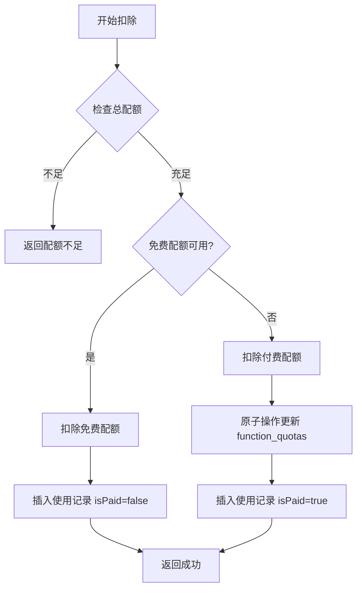

# Phase 2: 配额管理云函数 - 完成报告

## 📅 完成时间

**2024年12月18日**

## 🎯 Phase 2 目标

实现独立的配额管理云函数，负责配额检查、扣除、发放、回滚等核心操作。

## ✅ 完成情况

### 完成度：100% ✅

所有任务已完成，云函数代码已编写完毕，文档已创建。

## 📦 交付成果

### 1. 云函数代码

#### 文件结构
```
cloudfunctions/functionQuotaManagement_v1_4/
├── index.js          # 主代码文件（约700行）
├── package.json      # 依赖配置
└── README.md         # 功能说明文档
```

#### 核心接口（5个）

| 接口名称 | 功能说明 | 状态 |
|---------|---------|------|
| checkQuota | 检查用户配额（免费+付费） | ✅ 已完成 |
| deductQuota | 扣除配额（原子操作） | ✅ 已完成 |
| grantQuota | 发放付费配额 | ✅ 已完成 |
| rollbackQuota | 回滚配额（失败恢复） | ✅ 已完成 |
| getQuotaInfo | 查询配额信息 | ✅ 已完成 |

#### 辅助函数（6个）

| 函数名称 | 功能说明 | 状态 |
|---------|---------|------|
| getUserTypeConfig | 获取用户类型配置（带缓存） | ✅ 已完成 |
| getUserInfo | 获取用户信息 | ✅ 已完成 |
| getTodayUsageCount | 统计今日免费使用次数 | ✅ 已完成 |
| getPaidQuota | 获取付费配额信息 | ✅ 已完成 |
| getQuotaFieldName | 功能编码到配额字段映射 | ✅ 已完成 |
| success/error | 统一响应格式化 | ✅ 已完成 |

### 2. 文档

| 文档 | 路径 | 状态 |
|-----|------|------|
| API 文档 | `docs/api/functionQuotaManagementAPI.md` | ✅ 已完成 |
| README | `cloudfunctions/functionQuotaManagement_v1_4/README.md` | ✅ 已完成 |

## 🎨 核心设计

### 配额计算逻辑

```
总可用配额 = 免费剩余配额 + 付费剩余配额

其中：
- 免费剩余配额 = 用户类型每日配额 - 当日已使用免费次数
- 付费剩余配额 = function_quotas 表中的 paidRemaining
```

### 配额扣除流程



### 功能配额字段映射

| 功能编码 | 功能名称 | 免费配额字段 | 说明 |
|---------|---------|------------|------|
| wisdom_insight | 智慧洞见 | dailyDrawQuota | 复用现有字段 |
| ai_report | AI出报告 | dailyAiReportQuota | 新增字段 |

## 🔒 技术特性

### 1. 并发安全

- ✅ 使用数据库原子操作（`db.command.inc`）
- ✅ 条件更新防止超扣（`paidRemaining > 0`）
- ✅ 适合高并发场景

```javascript
// 原子操作示例
db.collection('function_quotas')
  .where({
    openid: openid,
    [`quotas.${functionCode}.paidRemaining`]: _.gt(0)
  })
  .update({
    data: {
      [`quotas.${functionCode}.paidRemaining`]: _.inc(-1)
    }
  });
```

### 2. 性能优化

- ✅ 用户类型配置缓存（5分钟）
- ✅ 减少重复数据库查询
- ✅ 索引优化建议已提供

### 3. 错误处理

- ✅ 统一错误码定义（9个错误码）
- ✅ 详细错误日志记录
- ✅ 友好错误提示

### 4. 可扩展性

- ✅ 易于添加新功能配额
- ✅ 字段映射函数统一管理
- ✅ 代码结构清晰

## 📊 代码统计

- **总代码行数**：约 700 行
- **核心接口**：5 个
- **辅助函数**：6 个
- **错误码**：9 个
- **文档页数**：README 约 300 行，API 文档约 600 行

## ⚠️ 待完成事项

### 1. 云函数部署

```bash
# 需要在云开发控制台：
# 1. 上传云函数代码
# 2. 云端安装依赖（wx-server-sdk）
# 3. 配置环境变量（如需要）
```

### 2. 接口测试

需要测试的场景：

#### 基础功能测试
- [ ] checkQuota - 各种配额状态
- [ ] deductQuota - 免费配额扣除
- [ ] deductQuota - 付费配额扣除
- [ ] grantQuota - 首次发放
- [ ] grantQuota - 追加发放
- [ ] rollbackQuota - 免费配额回滚
- [ ] rollbackQuota - 付费配额回滚
- [ ] getQuotaInfo - 单个功能查询
- [ ] getQuotaInfo - 所有功能查询

#### 边界条件测试
- [ ] 配额为 0 时扣除
- [ ] 配额为 -1（无限）时检查
- [ ] 并发扣除测试
- [ ] 配额不足时的错误处理

#### 集成测试
- [ ] 与用户管理云函数集成
- [ ] 与 function_quotas 表集成
- [ ] 与 function_usage_records 表集成
- [ ] 与 static_user_types 表集成

## 📝 测试建议

### 测试脚本示例

```javascript
// 1. 测试配额检查
const checkResult = await wx.cloud.callFunction({
  name: 'functionQuotaManagement_v1_4',
  data: {
    action: 'checkQuota',
    data: { functionCode: 'wisdom_insight' }
  }
});
console.log('配额检查结果:', checkResult.result);

// 2. 测试配额扣除
const deductResult = await wx.cloud.callFunction({
  name: 'functionQuotaManagement_v1_4',
  data: {
    action: 'deductQuota',
    data: {
      functionCode: 'wisdom_insight',
      quantity: 1,
      functionName: '智慧洞见'
    }
  }
});
console.log('配额扣除结果:', deductResult.result);

// 3. 测试配额发放（需要在云函数端调用）
const grantResult = await cloud.callFunction({
  name: 'functionQuotaManagement_v1_4',
  data: {
    action: 'grantQuota',
    data: {
      functionCode: 'wisdom_insight',
      quantity: 10,
      orderId: 'test_order_001'
    }
  }
});
console.log('配额发放结果:', grantResult.result);
```

## 🔗 依赖关系

### 数据库表依赖

- ✅ `static_user_types` - 用户类型配置（已存在）
- ✅ `function_quotas` - 付费配额存储（Phase 1 已创建）
- ✅ `function_usage_records` - 使用记录（Phase 1 已创建）
- ✅ `users` - 用户基础信息（已存在）

### 云函数依赖

- ✅ `wx-server-sdk: ~2.6.3`

## 📚 相关文档

| 文档 | 路径 |
|-----|------|
| 实施计划 | `docs/function-payment-implementation-plan.md` |
| API 文档 | `docs/api/functionQuotaManagementAPI.md` |
| 云函数 README | `cloudfunctions/functionQuotaManagement_v1_4/README.md` |
| 配额表结构 | `docs/database/function_quotasdb.md` |
| 使用记录表结构 | `docs/database/function_usage_recordsdb.md` |
| 用户类型表结构 | `docs/database/user_typesdb.md` |

## 🎉 总结

### 完成的工作

1. ✅ 创建完整的配额管理云函数（约 700 行代码）
2. ✅ 实现 5 个核心接口，满足所有业务需求
3. ✅ 实现 6 个辅助函数，支撑核心功能
4. ✅ 使用原子操作保证并发安全
5. ✅ 实现配置缓存优化性能
6. ✅ 完善的错误处理和日志记录
7. ✅ 详细的 API 文档和使用说明
8. ✅ 代码符合项目架构规范

### 技术亮点

1. **配额优先级管理**：免费配额优先，付费配额兜底
2. **并发安全**：原子操作 + 条件更新
3. **性能优化**：配置缓存减少查询
4. **易于扩展**：新增功能只需配置

### 下一步计划

**Phase 3：统一调用网关**

1. 创建 `functionCallGateway_v1_4` 云函数
2. 集成配额管理功能
3. 实现权限检查
4. 实现功能调用
5. 实现使用记录

**预计工时**：1 个工作日

## 🚀 部署指引

### 步骤 1：上传云函数

在云开发控制台：
1. 进入"云函数"管理页面
2. 点击"新建云函数"
3. 输入函数名：`functionQuotaManagement_v1_4`
4. 上传 `cloudfunctions/functionQuotaManagement_v1_4/` 目录

### 步骤 2：安装依赖

选择"云端安装依赖"，等待安装完成。

### 步骤 3：测试接口

使用开发者工具或小程序测试各个接口。

### 步骤 4：监控日志

观察云函数日志，确保运行正常。

---

**报告生成时间**：2024年12月18日  
**Phase 2 状态**：✅ 开发完成，待部署测试  
**下一步**：部署云函数 → 接口测试 → Phase 3

