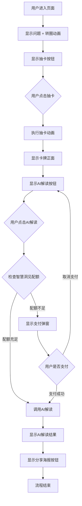

# 智慧洞见页面 - 两步操作 UE 设计方案

## 一、需求概述

将当前的"抽卡+AI解读"流程拆分为两个独立的操作步骤：
1. **抽卡步骤**：用户主动点击抽卡，无次数限制（免费）
2. **AI解读步骤**：用户主动点击AI解读，有次数限制（使用智慧洞见配额）

## 二、当前流程分析

### 2.1 现有流程
```
用户点击"抽卡"按钮
  ↓
检查配额（智慧洞见配额）
  ↓
执行抽卡动画
  ↓
显示卡牌（翻转动画）
  ↓
自动调用AI解读（无需用户操作）
  ↓
显示AI解读结果
  ↓
显示"生成分享海报"按钮
```

### 2.2 存在的问题
- 抽卡和AI解读绑定在一起，用户无法只抽卡不解读
- 抽卡也需要消耗配额，限制了用户体验
- 用户无法多次抽卡选择心仪的卡牌

## 三、新流程设计

### 3.1 状态流转简化图

```
初始状态 → 抽卡完成 → AI解读完成
   ↓          ↓           ↓
显示"抽卡"  显示"AI解读"  显示"分享海报"
```

### 3.2 完整流程图



### 3.2 状态流转图

```
初始状态：
- showDrawButton: true（显示抽卡按钮）
- showInterpretButton: false（隐藏AI解读按钮）
- showShareButton: false（隐藏分享按钮）
- selectedCard: null
- aiInterpretation: ''

抽卡完成后：
- showDrawButton: false（隐藏抽卡按钮）
- showInterpretButton: true（显示AI解读按钮）
- showShareButton: false（隐藏分享按钮）
- selectedCard: { cardNumber, cardName, ... }
- aiInterpretation: ''

AI解读完成后：
- showDrawButton: false（隐藏抽卡按钮，不允许再次抽卡）
- showInterpretButton: false（隐藏AI解读按钮）
- showShareButton: true（显示分享按钮）
- selectedCard: { cardNumber, cardName, ... }
- aiInterpretation: 'AI解读结果...'
```

## 四、页面状态设计

### 4.1 状态定义

| 状态名称 | 说明 | 按钮显示 | 数据状态 |
|---------|------|---------|---------|
| **初始状态** | 页面刚加载，未抽卡 | 显示"抽卡"按钮 | selectedCard: null, aiInterpretation: '' |
| **抽卡完成** | 抽卡动画完成，卡牌已显示 | 显示"AI解读"按钮 | selectedCard: {...}, aiInterpretation: '' |
| **解读完成** | AI解读成功，结果已显示 | 显示"生成分享海报"按钮 | selectedCard: {...}, aiInterpretation: '...' |
| **解读失败** | AI解读失败（配额不足/网络错误） | 显示"AI解读"按钮（可重试） | selectedCard: {...}, aiInterpretation: '' |

### 4.2 按钮显示逻辑

```javascript
// 抽卡按钮显示条件
showDrawButton = true  // 仅初始状态显示

// AI解读按钮显示条件
showInterpretButton = true  // 抽卡完成且未解读成功

// 分享按钮显示条件
showShareButton = true  // AI解读成功
```

## 五、交互细节设计

### 5.1 抽卡步骤

**交互流程：**
1. 用户点击"抽卡"按钮
2. 按钮显示"抽卡中..."（loading状态）
3. 执行抽卡动画（2秒）
4. 卡牌翻转显示正面
5. 按钮变为"AI解读"按钮

**关键点：**
- ✅ **无配额检查**：抽卡完全免费，不消耗任何配额
- ✅ **可重复抽卡**：用户可以在解读完成后再次抽卡
- ✅ **动画流畅**：保持现有的抽卡动画效果

### 5.2 AI解读步骤

**交互流程：**
1. 用户点击"AI解读"按钮
2. 按钮显示"解读中..."（loading状态）
3. **检查智慧洞见配额**
4. 如果配额充足：
   - 调用AI解读接口
   - 显示解读结果
   - 显示"生成分享海报"按钮
   - 隐藏"抽卡"按钮（不允许再次抽卡）
5. 如果配额不足：
   - 弹出支付弹窗
   - 用户支付成功后自动调用AI解读
   - 或用户取消，保持当前状态

**关键点：**
- ✅ **配额检查**：使用智慧洞见配额系统
- ✅ **支付流程**：配额不足时自动弹出支付弹窗
- ✅ **可重试**：解读失败后可以重试

### 5.3 流程结束

**场景：** 用户已完成一次完整的抽卡+解读流程

**交互说明：**
- 用户完成AI解读后，页面只显示"生成分享海报"按钮
- 用户无法在当前页面再次抽卡
- 如需再次使用，需要返回首页重新进入

**关键点：**
- ✅ **流程闭环**：一次完整的体验流程
- ✅ **避免重复**：防止用户在同一问题下多次抽卡
- ✅ **引导分享**：完成解读后引导用户分享结果

## 六、按钮文案设计

### 6.1 抽卡按钮

| 状态 | 文案 | 说明 |
|-----|------|------|
| 初始状态 | `抽卡` | 未抽卡时 |
| 加载中 | `抽卡中...` | 抽卡动画进行中 |

### 6.2 AI解读按钮

| 状态 | 文案 | 说明 |
|-----|------|------|
| 抽卡完成后 | `AI解读（剩余X次）` | 显示剩余配额 |
| 加载中 | `解读中...` | AI解读进行中 |
| 配额不足 | `AI解读（需付费）` | 配额为0时 |

### 6.3 分享按钮

| 状态 | 文案 | 说明 |
|-----|------|------|
| 解读完成后 | `生成分享海报` | 解读成功后可分享 |
| 加载中 | `生成中...` | 海报生成中 |

## 七、配额显示策略

### 7.1 抽卡按钮
- **不显示配额信息**：抽卡完全免费，无需显示配额
- **文案固定**：`抽卡`

### 7.2 AI解读按钮
- **显示配额信息**：`AI解读（剩余X次）`
- **配额为0时**：`AI解读（需付费）`
- **实时更新**：每次解读后刷新配额显示

## 八、异常情况处理

### 8.1 抽卡失败
- **网络错误**：显示Toast提示，允许重试
- **图片加载失败**：显示Toast提示，允许重试
- **不影响配额**：抽卡失败不消耗任何配额

### 8.2 AI解读失败

**配额不足：**
- 弹出支付弹窗
- 用户支付成功后自动调用AI解读
- 用户取消则保持当前状态（可再次点击）

**网络错误：**
- 显示Toast提示
- 保持"AI解读"按钮显示，允许重试
- **不消耗配额**：网络错误不扣除配额

**功能调用失败：**
- 显示Toast提示
- 保持"AI解读"按钮显示，允许重试
- **不消耗配额**：调用失败不扣除配额

### 8.3 用户中断
- **抽卡动画中**：允许中断（但当前实现不支持，保持现状）
- **AI解读中**：允许中断（通过按钮loading状态控制）

## 九、用户体验优化

### 9.1 视觉反馈
- ✅ 按钮loading状态清晰
- ✅ 卡牌翻转动画流畅
- ✅ 状态切换平滑

### 9.2 操作引导
- ✅ 按钮文案清晰（"抽卡" → "AI解读" → "生成分享海报"）
- ✅ 配额信息明确（AI解读按钮显示剩余次数）
- ✅ 错误提示友好（网络错误、配额不足等）

### 9.3 流程优化
- ✅ 抽卡免费，降低使用门槛
- ✅ 一次完整流程，避免重复操作
- ✅ AI解读按需使用，节省配额

## 十、技术实现要点

### 10.1 配额检查时机调整

**当前实现：**
- 抽卡前检查配额（`_checkDrawQuota`）
- 抽卡和解读共用配额

**新实现：**
- 抽卡前：**不检查配额**（完全免费）
- AI解读前：检查智慧洞见配额（`functionController.useFunction`）

### 10.2 状态管理

```javascript
data: {
  // 按钮显示控制
  showDrawButton: true,        // 初始显示
  showInterpretButton: false,   // 抽卡后显示
  showShareButton: false,       // 解读后显示
  
  // 卡牌和解读数据
  selectedCard: null,
  aiInterpretation: '',
  
  // 配额信息（仅用于AI解读按钮显示）
  wisdomInsightQuota: null,
  interpretButtonText: 'AI解读'
}
```

### 10.3 关键代码修改点

1. **`onAnalyzeAnswer` 方法**：
   - 移除配额检查逻辑
   - 移除自动调用AI解读的逻辑
   - 抽卡完成后只显示"AI解读"按钮

2. **`onAIInterpret` 方法**：
   - 保持配额检查逻辑
   - 保持支付流程
   - 解读成功后只显示"分享海报"按钮（不显示抽卡按钮）

3. **状态管理**：
   - AI解读成功后，隐藏抽卡按钮
   - 只显示分享海报按钮
   - 流程结束，用户需返回首页重新开始

## 十一、方案对比

### 11.1 当前方案 vs 新方案

| 维度 | 当前方案 | 新方案 |
|-----|---------|--------|
| **抽卡限制** | 需要配额 | 完全免费 |
| **操作步骤** | 1步（抽卡自动解读） | 2步（抽卡 + 解读） |
| **用户选择** | 无法只抽卡不解读 | 可以只抽卡，按需解读 |
| **重复抽卡** | 需要重新检查配额 | 不支持，一次完整流程 |
| **配额消耗** | 抽卡时消耗 | 仅解读时消耗 |
| **用户体验** | 流程固定 | 更灵活，用户主导 |

### 11.2 优势分析

✅ **降低使用门槛**：抽卡免费，用户可以随意体验
✅ **流程更清晰**：两步操作，用户更清楚每一步的作用
✅ **节省配额**：用户可以选择是否解读，避免浪费
✅ **引导分享**：完成解读后引导用户分享结果

### 11.3 潜在问题

⚠️ **用户可能只抽卡不解读**：需要引导用户进行解读
⚠️ **配额显示位置**：需要在AI解读按钮上清晰显示
⚠️ **无法再次抽卡**：用户如需再次使用需返回首页

## 十二、实施建议

### 12.1 开发优先级

1. **P0（必须）**：
   - 移除抽卡的配额检查
   - 移除抽卡后自动调用AI解读
   - 添加AI解读按钮显示逻辑

2. **P1（重要）**：
   - 优化按钮文案和配额显示
   - 完善错误处理
   - 优化状态切换逻辑

3. **P2（优化）**：
   - 优化状态切换动画
   - 添加操作引导提示
   - 优化用户体验细节

### 12.2 测试重点

- ✅ 抽卡不消耗配额
- ✅ AI解读消耗配额
- ✅ 配额不足时支付流程
- ✅ 解读完成后只显示分享按钮
- ✅ 各种异常情况处理

## 十三、待讨论问题

1. **AI解读按钮是否始终显示配额？**
   - 建议：显示，让用户清楚剩余次数

2. **是否需要在抽卡后提示用户进行解读？**
   - 建议：不需要，按钮已足够明显

3. **解读完成后是否允许用户返回重新抽卡？**
   - 已确定：不允许，用户需返回首页重新开始

---

**文档版本**：v1.0  
**创建时间**：2024-12-XX  
**设计者**：AI Assistant

