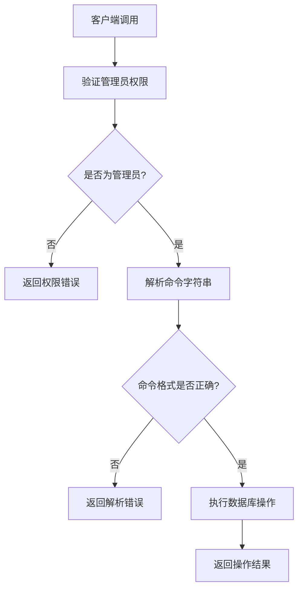

# 数据库调试云函数 API 文档

## 接口名称
数据库调试执行接口

## 描述
管理员专用的数据库调试工具，用于执行数据库操作指令。接收小程序客户端传递的字符串参数（JSON格式的数据库操作指令），执行后将结果返回给客户端。

**⚠️ 重要：此接口仅限管理员使用，普通用户无法调用。**

## 接口地址
云函数名称：`debug_database_v1_0`

## 请求方式
云函数调用（通过 `wx.cloud.callFunction`）

## 功能说明

此云函数用于管理员调试数据库操作，支持执行常见的数据库查询、添加、更新、删除等操作。



## 请求参数

### 参数格式

```json
{
  "command": "{\"operation\":\"get\",\"collection\":\"users\",\"where\":{}}"
}
```

### 参数说明

| 参数名 | 类型 | 必填 | 说明 |
|--------|------|------|------|
| command | string | 是 | 数据库操作指令，必须是有效的 JSON 字符串 |

### command 参数结构

`command` 是一个 JSON 字符串，解析后应包含以下字段：

| 字段名 | 类型 | 必填 | 说明 |
|--------|------|------|------|
| operation | string | 是 | 操作类型：`get`（查询）、`add`（添加）、`update`（更新）、`remove`（删除）、`count`（计数）、`aggregate`（聚合） |
| collection | string | 是 | 数据库集合名称 |
| where | object | 否 | 查询/更新/删除条件（对象格式） |
| data | object | 否 | 添加/更新的数据（对象格式，仅用于 add 和 update 操作） |
| field | object | 否 | 字段筛选（仅用于 get 操作） |
| orderBy | object | 否 | 排序规则（仅用于 get 操作），格式：`{field: "字段名", order: "asc|desc"}` |
| skip | number | 否 | 跳过记录数（仅用于 get 操作） |
| limit | number | 否 | 返回数量限制（仅用于 get 操作，最多100条） |
| stages | array | 否 | 聚合阶段数组（仅用于 aggregate 操作），每个阶段包含 `type` 和 `data` 字段 |

## 返回数据

### 成功响应

```json
{
  "success": true,
  "data": {
    "operation": "get",
    "collection": "users",
    "count": 10,
    "data": [
      {
        "_id": "xxx",
        "openid": "xxx",
        "nickName": "测试用户",
        "userType": "normal"
      }
    ]
  },
  "message": "数据库操作执行成功",
  "code": 0,
  "timestamp": 1694678400000
}
```

### 返回字段说明

| 字段名 | 类型 | 说明 |
|--------|------|------|
| success | boolean | 执行是否成功 |
| data | object | 操作结果数据 |
| data.operation | string | 执行的操作类型 |
| data.collection | string | 操作的集合名称 |
| data.count | number | 查询结果数量（仅 get 和 aggregate 操作） |
| data.data | array | 查询结果数组（仅 get 和 aggregate 操作） |
| data._id | string | 添加的记录ID（仅 add 操作） |
| data.inserted | number | 插入的记录数（仅 add 操作） |
| data.updated | number | 更新的记录数（仅 update 操作） |
| data.matched | number | 匹配的记录数（仅 update 操作） |
| data.removed | number | 删除的记录数（仅 remove 操作） |
| data.total | number | 总记录数（仅 count 操作） |
| message | string | 执行结果消息 |
| code | number | 响应码（0表示成功） |
| timestamp | number | 响应时间戳 |

### 错误响应

#### 权限不足

```json
{
  "success": false,
  "error": "非管理员用户，无权访问",
  "code": -403,
  "data": {
    "openid": "用户openid",
    "userType": "guest",
    "adminRole": "none"
  },
  "timestamp": 1694678400000
}
```

#### 参数错误

```json
{
  "success": false,
  "error": "命令解析失败: 缺少必需字段: operation",
  "code": -400,
  "data": {
    "command": "{\"collection\":\"users\"}",
    "error": "缺少必需字段: operation"
  },
  "timestamp": 1694678400000
}
```

#### 执行失败

```json
{
  "success": false,
  "error": "执行get操作失败: 集合不存在",
  "code": -500,
  "data": {
    "error": "集合不存在",
    "stack": "错误堆栈信息"
  },
  "timestamp": 1694678400000
}
```

## 操作类型详细说明

### 1. 查询操作 (get)

查询数据库记录。

**command 示例：**
```json
{
  "operation": "get",
  "collection": "users",
  "where": {
    "isActive": true,
    "userType": "normal"
  },
  "field": {},
  "orderBy": {
    "field": "createTime",
    "order": "desc"
  },
  "skip": 0,
  "limit": 20
}
```

**返回示例：**
```json
{
  "success": true,
  "data": {
    "operation": "get",
    "collection": "users",
    "count": 10,
    "data": [...]
  }
}
```

### 2. 添加操作 (add)

添加新记录。

**command 示例：**
```json
{
  "operation": "add",
  "collection": "users",
  "data": {
    "openid": "test_openid",
    "nickName": "测试用户",
    "userType": "guest",
    "isActive": true
  }
}
```

**返回示例：**
```json
{
  "success": true,
  "data": {
    "operation": "add",
    "collection": "users",
    "_id": "新记录的ID",
    "inserted": 1
  }
}
```

**注意：** 会自动添加 `createTime` 和 `updateTime` 字段。

### 3. 更新操作 (update)

更新记录。

**command 示例：**
```json
{
  "operation": "update",
  "collection": "users",
  "where": {
    "openid": "test_openid"
  },
  "data": {
    "nickName": "更新后的昵称"
  }
}
```

**返回示例：**
```json
{
  "success": true,
  "data": {
    "operation": "update",
    "collection": "users",
    "updated": 1,
    "matched": 1
  }
}
```

**注意：** 会自动添加 `updateTime` 字段。

### 4. 删除操作 (remove)

删除记录。

**command 示例：**
```json
{
  "operation": "remove",
  "collection": "users",
  "where": {
    "openid": "test_openid",
    "isActive": false
  }
}
```

**返回示例：**
```json
{
  "success": true,
  "data": {
    "operation": "remove",
    "collection": "users",
    "removed": 1
  }
}
```

### 5. 计数操作 (count)

统计记录数量。

**command 示例：**
```json
{
  "operation": "count",
  "collection": "users",
  "where": {
    "isActive": true,
    "userType": "normal"
  }
}
```

**返回示例：**
```json
{
  "success": true,
  "data": {
    "operation": "count",
    "collection": "users",
    "total": 100
  }
}
```

### 6. 聚合操作 (aggregate)

执行聚合查询。

**command 示例：**
```json
{
  "operation": "aggregate",
  "collection": "users",
  "stages": [
    {
      "type": "match",
      "data": {
        "isActive": true
      }
    },
    {
      "type": "group",
      "data": {
        "_id": "$userType",
        "count": 1
      }
    },
    {
      "type": "sort",
      "data": {
        "count": -1
      }
    }
  ]
}
```

**注意：** 聚合操作使用 `stages` 数组，每个阶段包含：
- `type`：阶段类型（`match`、`group`、`sort`、`limit`、`skip`、`project`）
- `data`：阶段数据（对象格式）

支持的阶段类型：
- `match`：匹配条件
- `group`：分组聚合
- `sort`：排序
- `limit`：限制数量
- `skip`：跳过记录
- `project`：字段投影

**返回示例：**
```json
{
  "success": true,
  "data": {
    "operation": "aggregate",
    "collection": "users",
    "count": 3,
    "data": [
      {
        "_id": "guest",
        "count": 50
      },
      {
        "_id": "normal",
        "count": 30
      },
      {
        "_id": "premium",
        "count": 20
      }
    ]
  }
}
```

## 使用示例

### 客户端调用示例

```javascript
// 查询用户列表
async function queryUsers() {
  try {
    const command = JSON.stringify({
      operation: 'get',
      collection: 'users',
      where: {
        isActive: true
      },
      orderBy: {
        field: 'createTime',
        order: 'desc'
      },
      limit: 20
    });
    
    const result = await wx.cloud.callFunction({
      name: 'debug_database_v1_0',
      data: { command }
    });
    
    if (result.result.success) {
      console.log('查询成功:', result.result.data);
      console.log('用户数量:', result.result.data.count);
      console.log('用户列表:', result.result.data.data);
    } else {
      console.error('查询失败:', result.result.error);
      
      // 检查错误类型
      if (result.result.code === -403) {
        console.error('权限不足，需要管理员权限');
      } else if (result.result.code === -400) {
        console.error('参数错误:', result.result.data.error);
      } else {
        console.error('执行失败:', result.result.error);
      }
    }
  } catch (error) {
    console.error('调用失败:', error);
  }
}

// 添加用户
async function addUser() {
  const command = JSON.stringify({
    operation: 'add',
    collection: 'users',
    data: {
      openid: 'test_openid_123',
      nickName: '测试用户',
      userType: 'guest',
      isActive: true
    }
  });
  
  const result = await wx.cloud.callFunction({
    name: 'debug_database_v1_0',
    data: { command }
  });
  
  console.log('添加结果:', result.result);
}

// 更新用户
async function updateUser() {
  const command = JSON.stringify({
    operation: 'update',
    collection: 'users',
    where: {
      openid: 'test_openid_123'
    },
    data: {
      nickName: '更新后的昵称'
    }
  });
  
  const result = await wx.cloud.callFunction({
    name: 'debug_database_v1_0',
    data: { command }
  });
  
  console.log('更新结果:', result.result);
}

// 统计用户数量
async function countUsers() {
  const command = JSON.stringify({
    operation: 'count',
    collection: 'users',
    where: {
      isActive: true,
      userType: 'normal'
    }
  });
  
  const result = await wx.cloud.callFunction({
    name: 'debug_database_v1_0',
    data: { command }
  });
  
  if (result.result.success) {
    console.log('用户总数:', result.result.data.total);
  }
}
```

## 错误码说明

| 错误码 | 说明 | 处理建议 |
|--------|------|---------|
| -400 | 参数错误 | 检查 command 参数格式是否正确，是否为有效的 JSON 字符串 |
| -403 | 权限不足 | 确认当前用户是否为管理员（userType === 'admin' 或 adminRole !== 'none'） |
| -500 | 服务器内部错误 | 查看云函数日志，检查数据库操作是否正确 |

## 权限验证

云函数会自动验证调用者是否为管理员：

1. **检查用户类型**：`userType === 'admin'`
2. **检查管理员角色**：`adminRole !== 'none'`

满足任一条件即可通过权限验证。

## 注意事项

1. **权限限制**：只有管理员可以调用此云函数，普通用户调用会返回权限错误
2. **安全考虑**：此函数仅用于调试，生产环境应谨慎使用
3. **数据限制**：查询操作（get）最多返回100条记录
4. **时间戳**：添加（add）和更新（update）操作会自动添加时间戳字段（createTime、updateTime）
5. **命令格式**：`command` 参数必须是有效的 JSON 字符串
6. **操作类型**：支持的操作类型：`get`、`add`、`update`、`remove`、`count`、`aggregate`
7. **集合名称**：确保集合名称正确，否则会执行失败

## 相关文档

- [云函数 README](../../cloudfunctions/debug_database_v1_0/README.md)
- [用户管理 API](./userManagementAPI.md)

---

**文档版本**：v1.0  
**创建时间**：2024年12月18日  
**维护者**：开发团队
