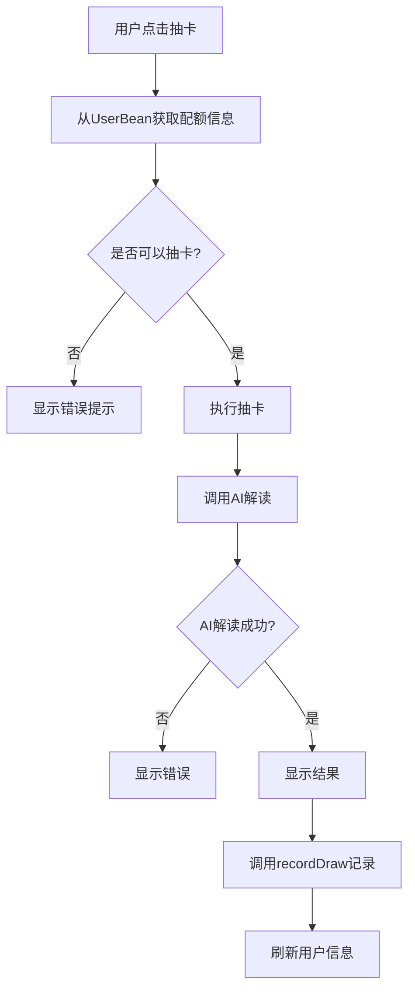

# drawCardManagement 云函数接口文档

> ⚠️ **废弃警告：此云函数已废弃**
> 
> 抽卡历史记录功能已迁移到 `cozeFunctions_v1_3` 云函数中。
> 当 AI 解读成功时，`cozeFunctions_v1_3` 会自动记录抽卡历史并返回更新后的配额信息。
> 
> **新的使用方式**：
> - 调用 `cozeFunctions_v1_3` 进行 AI 解读
> - 解读成功后会自动记录，无需单独调用此云函数
> - 返回值中包含 `drawCardQuota` 字段，包含更新后的配额信息
> 
> 此云函数保留仅作为备用接口，不建议新代码使用。
> 计划在未来版本中完全移除。
> 
> 参考文档：[cozeFunctions_v1_3 API文档](./cozeFunctions_v1_3-api.md)

## 接口概述

`drawCardManagement` 云函数用于记录抽卡历史。抽卡配额信息已集成到 `userManagement` 云函数的 `getUserInfo` 接口中，通过 `UserBean` 获取。

**⚠️ 已废弃**：抽卡配额检查已迁移到 `userManagement` 云函数，记录功能已迁移到 `cozeFunctions_v1_3` 云函数。

## 云函数信息

- **函数名称**: `drawCardManagement`
- **调用方式**: `wx.cloud.callFunction`
- **认证方式**: 小程序自动认证（通过 openid）
- **返回格式**: JSON

## 功能说明

### 整体流程



---

## 接口：记录抽卡历史

### 接口名称
记录抽卡和AI解读历史

### 接口地址
云函数：`drawCardManagement`

### 请求方式
POST（云函数调用）

### 功能说明
AI解读成功后，记录用户的抽卡信息、问题和AI解读结果。

### 请求参数

```javascript
{
  action: 'recordDraw',
  data: {
    question: "我今年的事业运势如何？",
    cardNumber: 15,
    cardName: "戊寅",
    aiAnswer: "根据戊寅的特性，今年你的事业运势呈现稳中有进的态势..."
  }
}
```

| 参数名 | 类型 | 必填 | 说明 |
|--------|------|------|------|
| action | string | 是 | 固定值：'recordDraw' |
| data | object | 是 | 记录数据 |
| data.question | string | 否 | 用户提出的问题（可为空） |
| data.cardNumber | number | 是 | 抽中的卡牌编号（1-60） |
| data.cardName | string | 是 | 抽中的卡牌名称（如"戊寅"） |
| data.aiAnswer | string | 是 | AI返回的解读结果 |

### 返回数据

#### 成功响应

```json
{
  "success": true,
  "message": "记录成功"
}
```

#### 失败响应

```json
{
  "success": false,
  "error": "用户不存在",
  "code": 1001
}
```

### 返回字段说明

| 字段名 | 类型 | 说明 |
|--------|------|------|
| success | boolean | 是否记录成功 |
| message | string | 成功消息 |
| error | string | 错误信息（失败时） |
| code | number | 错误码（失败时） |

### 使用示例

```javascript
// 在客户端调用（AI解读成功后）
async function recordDrawHistory(card, question, aiAnswer) {
  try {
    const res = await wx.cloud.callFunction({
      name: 'drawCardManagement',
      data: {
        action: 'recordDraw',
        data: {
          question: question || '',
          cardNumber: card.cardNumber,
          cardName: card.cardName,
          aiAnswer: aiAnswer
        }
      }
    });
    
    if (res.result.success) {
      console.log('记录成功');
    } else {
      console.error('记录失败:', res.result.error);
      // 记录失败不影响用户体验，静默处理
    }
  } catch (error) {
    console.error('记录异常:', error);
    // 静默处理
  }
}
```

---

## 完整使用流程示例

```javascript
// pages/answer/index.js
const { drawCardService } = require('../../services/DrawCardService');
const globalUserManager = require('../../utils/manager/globalUserManager');

Page({
  data: {
    question: '',
    selectedCard: null,
    aiInterpretation: '',
    userInfo: null // UserBean实例，包含配额信息
  },
  
  /**
   * 页面加载时获取用户信息（包含配额）
   */
  async onLoad() {
    await this.loadUserInfo();
  },
  
  /**
   * 加载用户信息（包含配额信息）
   */
  async loadUserInfo() {
    const response = await globalUserManager.getUserInfo();
    if (response.success) {
      this.setData({
        userInfo: response.data // UserBean实例
      });
    }
  },
  
  /**
   * 点击抽卡按钮
   */
  async onDrawCard() {
    // 1. 从UserBean检查配额
    const userInfo = this.data.userInfo;
    if (!userInfo || !userInfo.canDrawCard()) {
      this.showQuotaError(userInfo);
      return;
    }
    
    // 2. 执行抽卡动画
    const card = await this.doDrawCard();
    
    // 3. 自动调用AI解读
    const aiAnswer = await this.callAIInterpret(card);
    
    // 4. 记录历史
    if (aiAnswer) {
      await this.recordHistory(card, aiAnswer);
      // 5. 刷新用户信息（配额会更新）
      await this.loadUserInfo();
    }
  },
  
  /**
   * 记录历史
   */
  async recordHistory(card, aiAnswer) {
    const response = await drawCardService.recordDraw({
      question: this.data.question || '',
      cardNumber: card.cardNumber,
      cardName: card.cardName,
      aiAnswer: aiAnswer
    });
    
    if (!response.success) {
      console.warn('记录失败（不影响使用）:', response.error);
    }
  },
  
  /**
   * 显示配额错误
   */
  showQuotaError(userInfo) {
    let message = '抽卡功能不可用';
    
    if (!userInfo) {
      message = '请先注册后使用抽卡功能';
    } else if (userInfo.userType === 'guest') {
      message = '请先注册后使用抽卡功能';
    } else if (userInfo.getRemainingDrawQuota() === 0) {
      message = `今日抽卡次数已用完（${userInfo.dailyDrawQuota}次/天），明天再来吧~`;
    }
    
    wx.showToast({
      title: message,
      icon: 'none',
      duration: 2500
    });
  }
});
```

---

## 配额规则说明

### 用户类型配额

| 用户类型 | dailyDrawQuota | 说明 |
|---------|----------------|------|
| guest（临时用户） | 0 | 不可使用抽卡功能 |
| normal（普通用户） | 3 | 每天3次 |
| premium（高级用户） | -1 | 无限次数 |

### 计次规则

- **抽卡动画不计次**：用户可以随意查看抽卡动画
- **AI解读计次**：只有完成AI解读才计入配额
- **按天重置**：每天0点配额自动重置

### 时间处理

- 使用 UTC 时间存储
- 按日期字符串（YYYY-MM-DD）统计
- 避免时区问题影响配额统计

---

## 错误处理建议

### 客户端错误处理

```javascript
// 配额检查已集成到UserBean中
async function handleDrawCard() {
  try {
    // 1. 从UserBean检查配额
    const userInfo = await globalUserManager.getUserInfo();
    if (!userInfo.success || !userInfo.data) {
      wx.showToast({
        title: '获取用户信息失败，请重试',
        icon: 'none'
      });
      return;
    }
    
    const userBean = userInfo.data;
    if (!userBean.canDrawCard()) {
      // 配额不足或权限不足
      showQuotaError(userBean);
      return;
    }
    
    // 2. 执行抽卡
    // ...
    
  } catch (error) {
    console.error('抽卡失败:', error);
    wx.showToast({
      title: '操作失败，请重试',
      icon: 'error'
    });
  }
}
```

### 记录失败处理

```javascript
async function recordHistory(data) {
  try {
    await wx.cloud.callFunction({
      name: 'drawCardManagement',
      data: {
        action: 'recordDraw',
        data: data
      }
    });
  } catch (error) {
    // 记录失败不影响用户体验，静默处理
    console.error('记录失败（不影响使用）:', error);
  }
}
```

---

## 性能优化建议

1. **预加载用户信息**
   - 页面加载时预先获取用户信息（包含配额）
   - 避免点击时等待

2. **用户信息缓存**
   - 通过 `globalUserManager` 统一管理用户信息
   - 每次操作后更新缓存

3. **异步记录**
   - 记录操作不阻塞用户体验
   - 失败时静默处理

4. **错误重试**
   - 网络错误时自动重试
   - 最多重试3次

---

## 安全性说明

1. **身份验证**
   - 使用微信 openid 自动识别用户
   - 无需额外登录认证

2. **权限控制**
   - 配额检查在 `userManagement` 云函数中进行
   - 客户端无法绕过限制

3. **数据隔离**
   - 用户只能操作自己的数据
   - 无法查看其他用户的记录

4. **防刷机制**
   - 基于日期的配额限制
   - 记录时间戳防止作弊

---

## 数据库依赖

### 需要的数据表

1. **users** - 用户信息表
2. **static_user_types** - 用户类型配置表（需添加 dailyDrawQuota 字段）
3. **draw_card_records** - 抽卡记录表（新建）

### 需要的索引

1. **static_user_types.typeCode** - 唯一索引
2. **draw_card_records.userId + drawDate** - 复合索引（必须）
3. **draw_card_records.openid + drawDate** - 复合索引（可选）

---

## 相关文档

- [抽卡配额系统设计方案](../draw-card-quota-system.md)
- [抽卡记录表设计](../database/draw_card_recordsdb.md)
- [用户类型表设计](../database/user_typesdb.md)
- [用户表设计](../database/usersdb.md)

---

## 更新日志

| 版本 | 日期 | 说明 |
|------|------|------|
| 2.0 | 2024-12-XX | 移除checkQuota接口，配额信息已集成到userManagement云函数 |
| 1.0 | 2024-11-14 | 初始版本，实现配额检查和记录功能 |

