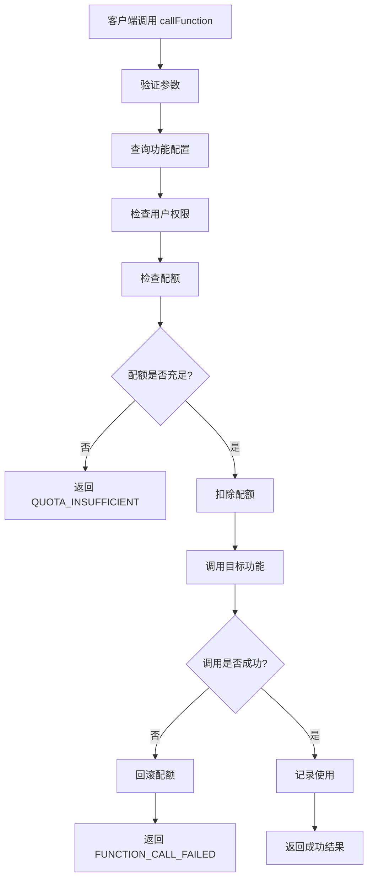

# 功能调用统一网关 API 文档

## 接口概述

云函数名称：`functionCallGateway_v1_4`

统一的功能调用网关，**主要用于收费功能的调用**，负责权限检查、配额检查、功能调用、使用记录等。

**注意**：免费功能（如 `GEN_BAZI`）不需要经过网关，可以直接调用目标云函数。

## 统一响应格式

### 成功响应
```json
{
  "success": true,
  "data": { /* 具体数据 */ },
  "message": "操作成功",
  "code": 0,
  "timestamp": 1702886400000
}
```

### 错误响应
```json
{
  "success": false,
  "error": "错误信息",
  "code": "ERROR_CODE",
  "data": null,
  "timestamp": 1702886400000
}
```

---

## 1. 统一调用接口

### 接口名称
callFunction

### 功能说明
统一的功能调用入口，自动处理权限检查、配额扣除、功能调用、使用记录等。

### 请求参数

```json
{
  "action": "callFunction",
  "data": {
    "functionCode": "wisdom_insight",
    "functionParams": {
      "parameters": {
        "question": "我应该换工作吗？"
      }
    }
  }
}
```

| 参数名 | 类型 | 必填 | 说明 |
|--------|------|------|------|
| functionCode | string | 是 | 功能编码（wisdom_insight: 智慧洞见, ai_report: AI出报告） |
| functionParams | object | 否 | 功能参数对象 |
| functionParams.parameters | object | 否 | 传递给目标云函数的参数（会与 callConfig.parameters 合并） |

### 返回数据

#### 成功响应
```json
{
  "success": true,
  "data": {
    "functionResult": {
      "data": { /* 功能返回的结果 */ },
      "workflowType": "WISDOM_INSIGHT",
      "workflowId": "7565131575660003366"
    },
    "quotaInfo": {
      "before": {
        "freeRemaining": 2,
        "paidRemaining": 5,
        "totalRemaining": 7
      },
      "after": {
        "freeRemaining": 1,
        "paidRemaining": 5,
        "totalRemaining": 6
      },
      "isPaid": false
    }
  },
  "message": "功能调用成功",
  "code": 0,
  "timestamp": 1702886400000
}
```

#### 错误响应（配额不足）
```json
{
  "success": false,
  "error": "配额不足",
  "code": "QUOTA_INSUFFICIENT",
  "data": {
    "quotaInfo": {
      "canUse": false,
      "freeRemaining": 0,
      "paidRemaining": 0,
      "totalRemaining": 0,
      "freeDailyQuota": 1,
      "freeUsedToday": 1
    }
  },
  "timestamp": 1702886400000
}
```

#### 错误响应（功能调用失败）
```json
{
  "success": false,
  "error": "功能调用失败",
  "code": "FUNCTION_CALL_FAILED",
  "data": {
    "quotaInfo": {
      "canUse": true,
      "freeRemaining": 1,
      "paidRemaining": 5,
      "totalRemaining": 6
    }
  },
  "timestamp": 1702886400000
}
```

### 调用流程



### 使用示例

#### 客户端调用
```javascript
// 调用智慧洞见
const result = await wx.cloud.callFunction({
  name: 'functionCallGateway_v1_4',
  data: {
    action: 'callFunction',
    data: {
      functionCode: 'wisdom_insight',
      functionParams: {
        parameters: {
          question: '我应该换工作吗？'
        }
      }
    }
  }
});

if (result.result.success) {
  const functionResult = result.result.data.functionResult;
  const quotaInfo = result.result.data.quotaInfo;
  
  console.log('功能调用成功:', functionResult);
  console.log('配额信息:', quotaInfo);
  console.log('是否付费使用:', quotaInfo.isPaid);
} else {
  if (result.result.code === 'QUOTA_INSUFFICIENT') {
    console.log('配额不足，请购买');
    // 引导用户购买
  } else if (result.result.code === 'FUNCTION_CALL_FAILED') {
    console.log('功能调用失败:', result.result.error);
  } else {
    console.error('调用失败:', result.result.error);
  }
}
```

#### 调用 AI出报告
```javascript
const result = await wx.cloud.callFunction({
  name: 'functionCallGateway_v1_4',
  data: {
    action: 'callFunction',
    data: {
      functionCode: 'ai_report',
      functionParams: {
        parameters: {
          cardName: '甲子',
          question: '感情问题'
        }
      }
    }
  }
});
```

### 配额处理说明

1. **配额扣除时机**：在调用功能前扣除，确保不会超用
2. **配额优先级**：优先使用免费配额，免费配额用完后使用付费配额
3. **配额回滚**：功能调用失败时自动回滚，保证用户权益
4. **并发安全**：使用原子操作扣除配额，保证并发安全

---

## 错误码说明

| 错误码 | 说明 | 处理建议 |
|--------|------|---------|
| INVALID_PARAMS | 参数错误 | 检查必填参数是否传递 |
| FUNCTION_NOT_FOUND | 功能不存在或已下架 | 检查 functionCode 是否正确 |
| INVALID_CONFIG | 功能配置错误 | 检查 function_products 表配置 |
| PERMISSION_DENIED | 无权限 | 检查用户权限配置 |
| CHECK_QUOTA_FAILED | 检查配额失败 | 查看日志排查问题 |
| QUOTA_INSUFFICIENT | 配额不足 | 引导用户购买配额 |
| DEDUCT_QUOTA_FAILED | 扣除配额失败 | 可能是并发问题，重试 |
| FUNCTION_CALL_FAILED | 功能调用失败 | 查看目标云函数日志 |
| RECORD_USAGE_FAILED | 记录使用失败 | 不影响主流程，查看日志 |
| INTERNAL_ERROR | 内部错误 | 查看云函数日志 |

---

## 功能编码说明

| 功能编码 | 功能名称 | 是否收费 | 调用方式 |
|---------|---------|---------|---------|
| wisdom_insight | 智慧洞见 | 是 | 通过网关调用 |
| ai_report | AI出报告 | 是 | 通过网关调用 |
| gen_bazi | 生成八字 | 否（免费） | **直接调用目标云函数**，不需要经过网关 |

### 收费功能调用（通过网关）

| 功能编码 | 目标云函数 | 工作流类型（数据库） | 实际工作流类型（调用） |
|---------|-----------|---------------------|---------------------|
| wisdom_insight | cozeFunctions_v1_3 | WISDOM_INSIGHT | DRAW_CARD（自动映射） |
| ai_report | cozeFunctions_v1_3 | AI_REPORT | AI_REPORT |

### 免费功能调用（直接调用）

```javascript
// GEN_BAZI 免费功能，直接调用，不需要经过网关
wx.cloud.callFunction({
  name: 'cozeFunctions_v1_3',
  data: {
    workflowType: 'GEN_BAZI',
    parameters: {
      year: 2024,
      month: 1,
      day: 15,
      hour: 10,
      min: 30
    }
  }
});
```

### 工作流类型映射说明
- **网关自动映射**：网关会将 `WISDOM_INSIGHT` 自动映射为 `DRAW_CARD`（两者是同一个功能）
- **映射逻辑**：在 `callTargetFunction` 函数中，通过 `mapWorkflowType()` 函数进行映射
- **优势**：可以在数据库中使用更语义化的名称（如 `WISDOM_INSIGHT`），而实际调用时映射到目标云函数支持的类型

---

## 配额信息说明

### quotaInfo 字段
- `before`：扣除前的配额信息
- `after`：扣除后的配额信息
- `isPaid`：是否使用付费配额（true=付费，false=免费）

### 配额计算
- `totalRemaining = freeRemaining + paidRemaining`
- `-1` 表示无限配额

---

## 使用记录

每次功能调用都会记录到 `function_usage_records` 表，包含：
- 用户信息（openid）
- 功能信息（functionCode, functionName）
- 使用时间（usageTime, usageDate）
- 使用参数和结果（usageData, result）
- 配额信息（isPaid, quotaBefore, quotaAfter）

---

## 注意事项

1. **免费功能**：免费功能（如 `GEN_BAZI`）**不需要经过网关**，直接调用目标云函数即可
2. **网关用途**：网关主要用于**收费功能**的配额管理和调用
3. **配额扣除**：收费功能在调用前扣除，确保不会超用
4. **配额回滚**：收费功能调用失败时自动回滚，保证用户权益
5. **使用记录**：记录失败不影响主流程，只记录日志
6. **并发安全**：配额扣除使用原子操作，保证并发安全
7. **参数合并**：用户传入的参数会与 callConfig.parameters 合并
8. **工作流映射**：网关自动将 `WISDOM_INSIGHT` 映射为 `DRAW_CARD`（两者是同一个功能）

---

## 相关文档

- [云函数 README](../../cloudfunctions/functionCallGateway_v1_4/README.md)
- [配额管理 API](./functionQuotaManagementAPI.md)
- [功能商品表结构](../database/function_productsdb.md)
- [功能使用记录表结构](../database/function_usage_recordsdb.md)
- [功能付费系统实施计划](../function-payment-implementation-plan.md)

---

**文档版本**：v1.0  
**创建时间**：2024年12月18日  
**维护者**：开发团队

