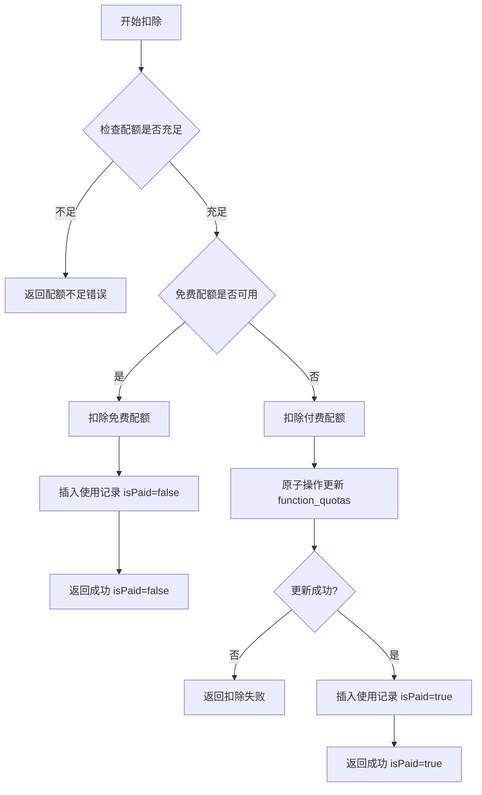
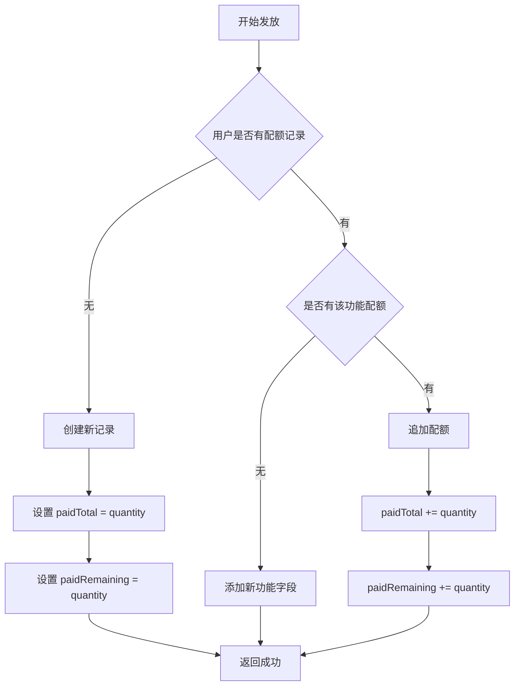
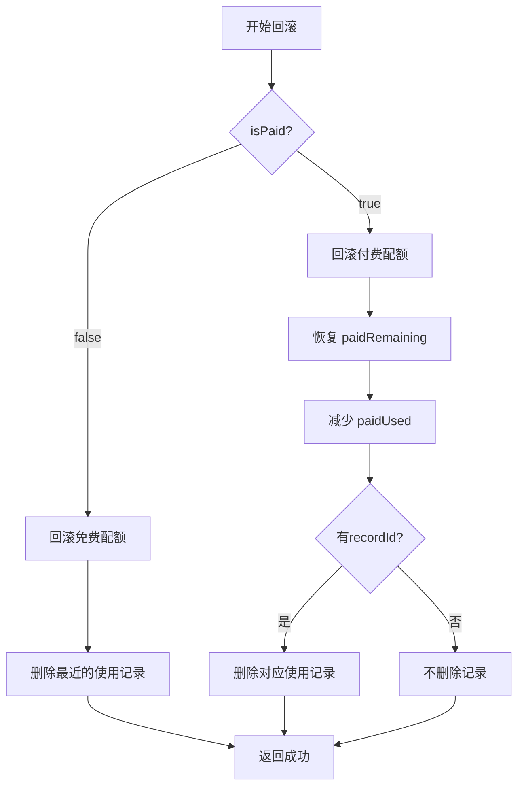

# 功能配额管理 API 文档

## 接口概述

云函数名称：`functionQuotaManagement_v1_4`

负责管理用户的功能配额，包括配额检查、扣除、发放、回滚等操作。

## 统一响应格式

### 成功响应
```json
{
  "success": true,
  "data": { /* 具体数据 */ },
  "message": "操作成功",
  "code": 0,
  "timestamp": 1702886400000
}
```

### 错误响应
```json
{
  "success": false,
  "error": "错误信息",
  "code": "ERROR_CODE",
  "data": null,
  "timestamp": 1702886400000
}
```

---

## 1. 检查配额

### 接口名称
checkQuota

### 功能说明
检查用户某个功能的可用配额，返回免费配额、付费配额和总配额信息。

### 请求参数

```json
{
  "action": "checkQuota",
  "data": {
    "functionCode": "wisdom_insight"
  }
}
```

| 参数名 | 类型 | 必填 | 说明 |
|--------|------|------|------|
| functionCode | string | 是 | 功能编码（wisdom_insight: 智慧洞见, ai_report: AI出报告） |

### 返回数据

#### 成功响应
```json
{
  "success": true,
  "data": {
    "canUse": true,
    "freeRemaining": 2,
    "paidRemaining": 5,
    "totalRemaining": 7,
    "freeDailyQuota": 3,
    "freeUsedToday": 1
  },
  "message": "配额检查完成",
  "code": 0,
  "timestamp": 1702886400000
}
```

#### 返回字段说明

| 字段名 | 类型 | 说明 |
|--------|------|------|
| canUse | boolean | 是否可以使用（总配额 > 0） |
| freeRemaining | number | 免费剩余配额（-1表示无限） |
| paidRemaining | number | 付费剩余配额 |
| totalRemaining | number | 总剩余配额（-1表示无限） |
| freeDailyQuota | number | 每日免费配额（-1表示无限，0表示不可用） |
| freeUsedToday | number | 今日已使用免费次数 |

#### 配额计算规则

```javascript
// 免费剩余配额
freeRemaining = freeDailyQuota === -1 
  ? -1  // 无限
  : Math.max(0, freeDailyQuota - freeUsedToday)

// 总剩余配额
totalRemaining = (freeRemaining === -1 || paidRemaining === -1)
  ? -1  // 任一无限则总配额无限
  : freeRemaining + paidRemaining
```

### 使用示例

```javascript
// 客户端调用
const result = await wx.cloud.callFunction({
  name: 'functionQuotaManagement_v1_4',
  data: {
    action: 'checkQuota',
    data: {
      functionCode: 'wisdom_insight'
    }
  }
});

if (result.result.success) {
  const quota = result.result.data;
  console.log('是否可用:', quota.canUse);
  console.log('免费剩余:', quota.freeRemaining);
  console.log('付费剩余:', quota.paidRemaining);
} else {
  console.error('检查失败:', result.result.error);
}
```

---

## 2. 扣除配额

### 接口名称
deductQuota

### 功能说明
扣除用户配额，优先扣除免费配额，免费配额用完后扣除付费配额。使用原子操作保证并发安全。

### 请求参数

```json
{
  "action": "deductQuota",
  "data": {
    "functionCode": "wisdom_insight",
    "quantity": 1,
    "functionName": "智慧洞见",
    "orderId": "order_xxx"
  }
}
```

| 参数名 | 类型 | 必填 | 说明 |
|--------|------|------|------|
| functionCode | string | 是 | 功能编码 |
| quantity | number | 否 | 扣除数量，默认1 |
| functionName | string | 否 | 功能名称（用于记录） |
| orderId | string | 否 | 关联的订单ID（付费使用时） |

### 返回数据

#### 成功响应（使用免费配额）
```json
{
  "success": true,
  "data": {
    "isPaid": false,
    "quantity": 1,
    "quotaBefore": {
      "freeRemaining": 2,
      "paidRemaining": 5,
      "totalRemaining": 7
    },
    "quotaAfter": {
      "freeRemaining": 1,
      "paidRemaining": 5,
      "totalRemaining": 6
    }
  },
  "message": "配额扣除成功",
  "code": 0
}
```

#### 成功响应（使用付费配额）
```json
{
  "success": true,
  "data": {
    "isPaid": true,
    "quantity": 1,
    "quotaBefore": {
      "freeRemaining": 0,
      "paidRemaining": 5,
      "totalRemaining": 5
    },
    "quotaAfter": {
      "freeRemaining": 0,
      "paidRemaining": 4,
      "totalRemaining": 4
    }
  },
  "message": "配额扣除成功",
  "code": 0
}
```

#### 错误响应（配额不足）
```json
{
  "success": false,
  "error": "配额不足",
  "code": "QUOTA_INSUFFICIENT",
  "data": {
    "canUse": false,
    "freeRemaining": 0,
    "paidRemaining": 0,
    "totalRemaining": 0
  }
}
```

#### 返回字段说明

| 字段名 | 类型 | 说明 |
|--------|------|------|
| isPaid | boolean | 是否使用付费配额 |
| quantity | number | 扣除的数量 |
| quotaBefore | object | 扣除前的配额信息 |
| quotaAfter | object | 扣除后的配额信息 |

### 扣除逻辑



### 使用示例

```javascript
// 客户端调用
const result = await wx.cloud.callFunction({
  name: 'functionQuotaManagement_v1_4',
  data: {
    action: 'deductQuota',
    data: {
      functionCode: 'wisdom_insight',
      quantity: 1,
      functionName: '智慧洞见'
    }
  }
});

if (result.result.success) {
  const deductInfo = result.result.data;
  
  if (deductInfo.isPaid) {
    console.log('使用了付费配额');
  } else {
    console.log('使用了免费配额');
  }
  
  console.log('配额扣除前:', deductInfo.quotaBefore);
  console.log('配额扣除后:', deductInfo.quotaAfter);
} else {
  if (result.result.code === 'QUOTA_INSUFFICIENT') {
    console.log('配额不足，请购买');
  } else {
    console.error('扣除失败:', result.result.error);
  }
}
```

---

## 3. 发放配额

### 接口名称
grantQuota

### 功能说明
发放付费配额（支付成功后调用），支持首次创建和追加发放。

### 请求参数

```json
{
  "action": "grantQuota",
  "data": {
    "functionCode": "wisdom_insight",
    "quantity": 10,
    "orderId": "order_xxx"
  }
}
```

| 参数名 | 类型 | 必填 | 说明 |
|--------|------|------|------|
| functionCode | string | 是 | 功能编码 |
| quantity | number | 是 | 发放数量 |
| orderId | string | 否 | 关联的订单ID |

### 返回数据

#### 成功响应
```json
{
  "success": true,
  "data": {
    "functionCode": "wisdom_insight",
    "quantity": 10,
    "orderId": "order_xxx"
  },
  "message": "配额发放成功",
  "code": 0
}
```

### 发放逻辑



### 使用示例

```javascript
// 云函数中调用（支付回调）
const grantResult = await cloud.callFunction({
  name: 'functionQuotaManagement_v1_4',
  data: {
    action: 'grantQuota',
    data: {
      functionCode: 'wisdom_insight',
      quantity: 10,
      orderId: orderId
    }
  }
});

if (grantResult.result.success) {
  console.log('配额发放成功');
  // 更新订单 grantInfo
} else {
  console.error('配额发放失败:', grantResult.result.error);
  // 标记发放失败，需要人工处理
}
```

---

## 4. 回滚配额

### 接口名称
rollbackQuota

### 功能说明
功能调用失败时回滚配额，确保用户权益不受损失。

### 请求参数

```json
{
  "action": "rollbackQuota",
  "data": {
    "functionCode": "wisdom_insight",
    "quantity": 1,
    "isPaid": false,
    "recordId": "record_xxx"
  }
}
```

| 参数名 | 类型 | 必填 | 说明 |
|--------|------|------|------|
| functionCode | string | 是 | 功能编码 |
| quantity | number | 否 | 回滚数量，默认1 |
| isPaid | boolean | 是 | 是否回滚付费配额 |
| recordId | string | 否 | 使用记录ID（可选） |

### 返回数据

#### 成功响应
```json
{
  "success": true,
  "data": {
    "functionCode": "wisdom_insight",
    "quantity": 1,
    "isPaid": false
  },
  "message": "配额回滚成功",
  "code": 0
}
```

### 回滚逻辑



### 使用示例

```javascript
// 云函数中调用（功能调用失败时）
try {
  // 1. 先扣除配额
  const deductResult = await cloud.callFunction({
    name: 'functionQuotaManagement_v1_4',
    data: {
      action: 'deductQuota',
      data: { functionCode: 'wisdom_insight' }
    }
  });
  
  const isPaid = deductResult.result.data.isPaid;
  
  // 2. 调用目标功能
  const funcResult = await cloud.callFunction({
    name: 'cozeFunctions_v1_3',
    data: { /* ... */ }
  });
  
  if (!funcResult.result.success) {
    // 3. 功能调用失败，回滚配额
    await cloud.callFunction({
      name: 'functionQuotaManagement_v1_4',
      data: {
        action: 'rollbackQuota',
        data: {
          functionCode: 'wisdom_insight',
          quantity: 1,
          isPaid: isPaid
        }
      }
    });
    
    throw new Error('功能调用失败');
  }
  
  return funcResult.result;
  
} catch (error) {
  console.error('操作失败:', error);
  throw error;
}
```

---

## 5. 获取配额信息

### 接口名称
getQuotaInfo

### 功能说明
获取用户的配额信息，支持查询单个功能或所有功能。

### 请求参数

#### 查询单个功能
```json
{
  "action": "getQuotaInfo",
  "data": {
    "functionCode": "wisdom_insight"
  }
}
```

#### 查询所有功能
```json
{
  "action": "getQuotaInfo",
  "data": {}
}
```

| 参数名 | 类型 | 必填 | 说明 |
|--------|------|------|------|
| functionCode | string | 否 | 功能编码（不传则返回所有功能） |

### 返回数据

#### 单个功能（与 checkQuota 相同）
```json
{
  "success": true,
  "data": {
    "canUse": true,
    "freeRemaining": 2,
    "paidRemaining": 5,
    "totalRemaining": 7,
    "freeDailyQuota": 3,
    "freeUsedToday": 1
  }
}
```

#### 所有功能
```json
{
  "success": true,
  "data": {
    "wisdom_insight": {
      "canUse": true,
      "freeRemaining": 2,
      "paidRemaining": 5,
      "totalRemaining": 7,
      "freeDailyQuota": 3,
      "freeUsedToday": 1
    },
    "ai_report": {
      "canUse": true,
      "freeRemaining": 1,
      "paidRemaining": 3,
      "totalRemaining": 4,
      "freeDailyQuota": 1,
      "freeUsedToday": 0
    }
  },
  "message": "获取配额信息成功"
}
```

### 使用示例

```javascript
// 查询单个功能
const result1 = await wx.cloud.callFunction({
  name: 'functionQuotaManagement_v1_4',
  data: {
    action: 'getQuotaInfo',
    data: {
      functionCode: 'wisdom_insight'
    }
  }
});

// 查询所有功能
const result2 = await wx.cloud.callFunction({
  name: 'functionQuotaManagement_v1_4',
  data: {
    action: 'getQuotaInfo',
    data: {}
  }
});

if (result2.result.success) {
  const allQuotas = result2.result.data;
  
  console.log('智慧洞见配额:', allQuotas.wisdom_insight);
  console.log('AI出报告配额:', allQuotas.ai_report);
}
```

---

## 错误码说明

| 错误码 | 说明 | 处理建议 |
|--------|------|---------|
| INVALID_PARAMS | 参数错误 | 检查必填参数是否传递 |
| CHECK_QUOTA_FAILED | 检查配额失败 | 查看日志排查问题 |
| QUOTA_INSUFFICIENT | 配额不足 | 引导用户购买 |
| DEDUCT_QUOTA_FAILED | 扣除配额失败 | 可能是并发问题，重试 |
| GRANT_QUOTA_FAILED | 发放配额失败 | 记录日志，人工处理 |
| ROLLBACK_QUOTA_FAILED | 回滚配额失败 | 记录日志，人工处理 |
| GET_QUOTA_INFO_FAILED | 获取配额信息失败 | 查看日志排查问题 |
| INVALID_ACTION | 无效的操作类型 | 检查 action 参数 |
| INTERNAL_ERROR | 内部错误 | 查看云函数日志 |

---

## 功能编码说明

| 功能编码 | 功能名称 | 免费配额字段 | 目标云函数 |
|---------|---------|------------|-----------|
| wisdom_insight | 智慧洞见 | dailyDrawQuota | cozeFunctions_v1_3 |
| ai_report | AI出报告 | dailyAiReportQuota | cozeFunctions_v1_3 |

---

## 配额类型说明

### 免费配额
- 存储位置：`static_user_types` 表（配置）+ `function_usage_records` 表（使用记录）
- 有效期：每日重置
- 计算方式：每日配额 - 当日使用次数
- 扣除方式：插入使用记录，isPaid=false

### 付费配额
- 存储位置：`function_quotas` 表
- 有效期：永久有效
- 计算方式：直接读取 paidRemaining
- 扣除方式：原子操作更新 paidRemaining

---

## 并发安全说明

### 原子操作
付费配额的扣除使用数据库原子操作：

```javascript
db.collection('function_quotas')
  .where({
    openid: openid,
    [`quotas.${functionCode}.paidRemaining`]: _.gt(0)  // 条件检查
  })
  .update({
    data: {
      [`quotas.${functionCode}.paidRemaining`]: _.inc(-1)  // 原子递减
    }
  });
```

### 并发测试
建议进行并发测试，确保在高并发情况下配额不会超扣。

---

## 性能优化

### 配置缓存
- 用户类型配置缓存 5 分钟
- 减少数据库查询次数

### 索引优化
确保以下索引已创建：
- `function_quotas`: openid（唯一索引）
- `function_usage_records`: openid + functionCode + usageDate（复合索引）

---

## 相关文档

- [云函数 README](../../cloudfunctions/functionQuotaManagement_v1_4/README.md)
- [功能配额表结构](../database/function_quotasdb.md)
- [功能使用记录表结构](../database/function_usage_recordsdb.md)
- [用户类型配置表结构](../database/user_typesdb.md)
- [功能付费系统设计](../function-payment-design.md)
- [功能付费系统实施计划](../function-payment-implementation-plan.md)

---

**文档版本**：v1.0  
**创建时间**：2024年12月18日  
**维护者**：开发团队

