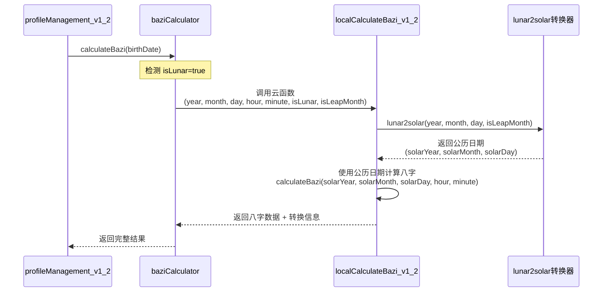
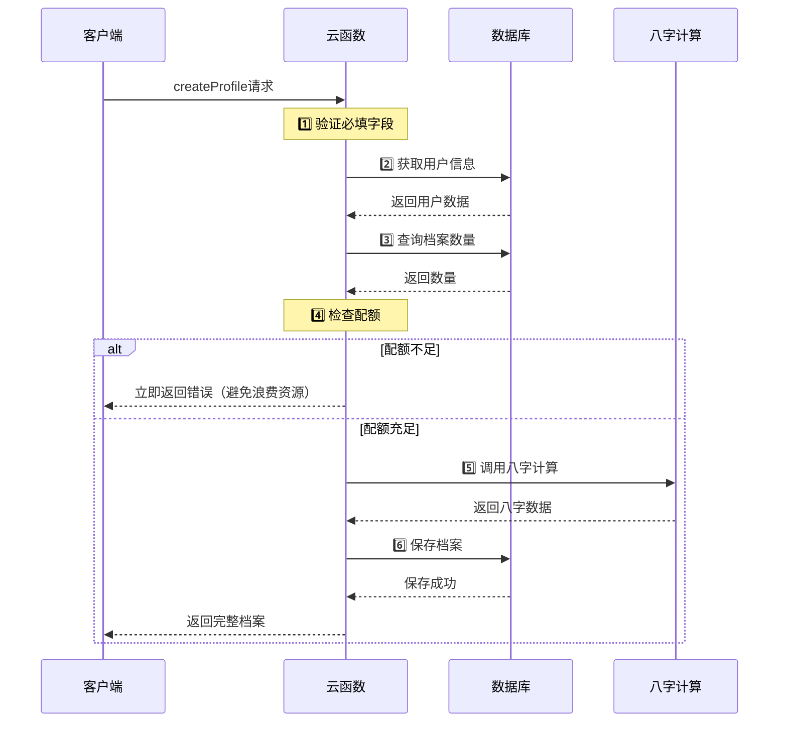
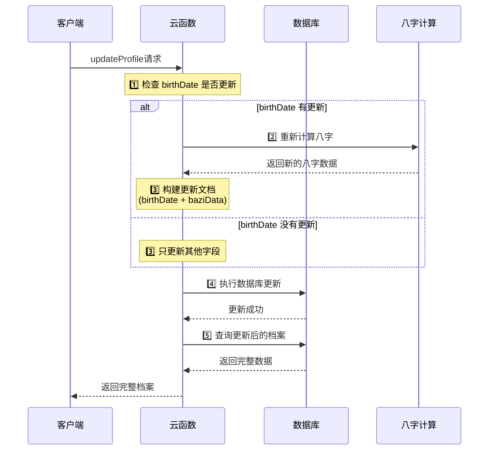

# 档案管理云函数API文档 v1.2

## 接口概述
档案管理云函数提供八字档案的创建、查询、更新和删除功能，支持用户创建多个生辰八字档案。

## 接口地址
`profileManagement_v1_2` 云函数

## 请求方式
POST（云函数调用）

## 功能说明
档案管理云函数采用action模式，支持以下操作：
- createProfile: 创建八字档案
- getProfiles: 获取用户的所有档案
- getProfile: 获取单个档案详情
- updateProfile: 更新档案信息
- deleteProfile: 删除档案（软删除）
- searchProfile: 搜索档案

### ⭐ 农历日期处理流程

当 `birthDate.isLunar=true` 时，系统会自动进行农历转公历：



**处理逻辑说明**：
1. `profileManagement_v1_2` 接收带有 `isLunar` 标识的 `birthDate`
2. 调用 `baziCalculator.calculateBazi()` 进行八字计算
3. `baziCalculator` 将所有参数（包括 `isLunar` 和 `isLeapMonth`）传递给 `localCalculateBazi_v1_2` 云函数
4. `localCalculateBazi_v1_2` 检测到农历日期，调用内置的 `lunar2solar` 转换器
5. 转换为公历后，使用公历日期进行八字计算（因为八字计算必须基于公历）
6. 返回结果中包含：
   - 原始输入信息（`inputDate`）
   - 转换后的公历日期（`converted`，仅农历时存在）
   - 计算的八字数据（`baziData`）

**技术细节**：
- 转换器使用 `js-calendar-converter.cjs` 的 `lunar2solar` 方法
- 支持农历闰月转换（`isLeapMonth` 参数）
- 公历日期范围：1900-2100 年
- 转换后的公历日期用于八字计算，确保结果准确

### 创建档案执行流程（性能优化）


**执行顺序说明**：
1. 先验证字段完整性
2. 获取用户信息和权限配置
3. 检查档案配额（**优先检查**）
4. 配额检查通过后，才执行耗时的八字计算
5. 保存档案数据（birthDate + baziData 同步保存）

**性能优化点**：
- ⚡ 配额不足时立即返回，不浪费计算资源
- ⚡ 八字计算是耗时操作，放在配额检查之后执行
- ⚡ 减少用户等待时间，提升体验

### 更新档案执行流程


**更新流程说明**：
1. 检测 `birthDate` 是否变更
2. **条件计算**：只有 `birthDate` 变化时才重新计算八字
3. 构建更新文档（确保 `birthDate` 和 `baziData` 同步）
4. 执行数据库更新操作
5. 查询并返回更新后的完整档案数据

**数据一致性保证**：
- ✅ `birthDate` 和 `baziData` 总是同步更新
- ✅ 八字数据与出生日期保持一致
- ✅ 避免不必要的重复计算

## 版本更新说明

### v1.2 更新内容（新增）
- **农历闰月支持**：新增 `birthDate.isLeapMonth` 字段，支持存储和识别农历闰月
- **农历自动转换**：⭐ 农历日期自动转换为公历后进行八字计算（由 `localCalculateBazi_v1_2` 云函数处理）
- **向前兼容**：老数据自动补充默认值，不影响已有档案
- **完善日历类型**：`birthDate.isLunar` 字段明确标识公历/农历类型
- **数据完整性**：确保农历档案包含完整的闰月信息
- **自动格式化**：ProfileBean 自动识别并格式化农历闰月显示

### v1.1 更新内容
- **自动八字计算**：createProfile和updateProfile现在自动计算八字数据，无需客户端传入
- **createProfile 方法增强**：现在返回完整的ProfileBean数据，包含所有字段
- **updateProfile 方法增强**：现在返回更新后的完整ProfileBean数据，自动重新计算八字
- **数据一致性提升**：所有操作都返回完整的档案信息，客户端可直接使用
- **客户端简化**：减少客户端手动构建档案对象的复杂度，直接使用云函数返回的数据
- **性能优化**：减少网络请求次数，服务端统一处理八字计算
- **时间处理修复**：修复了时区处理问题，确保八字计算使用正确的北京时间

## API列表

### 1. 创建八字档案

#### 请求参数
```javascript
{
  "action": "createProfile",
  "data": {
    "profileName": "我的生辰八字",
    "birthDate": {
      "year": 1990,
      "month": 5,
      "day": 15,
      "hour": 14,
      "minute": 30,
      "isLunar": false,
      "isLeapMonth": false
    },
    "gender": 1,
    "isUncertainTime": false,
    "description": "本人生辰八字档案"
  }
}
```

#### 农历闰月示例
```javascript
{
  "action": "createProfile",
  "data": {
    "profileName": "农历闰月档案",
    "birthDate": {
      "year": 1990,
      "month": 5,
      "day": 15,
      "hour": 14,
      "minute": 30,
      "isLunar": true,        // 标记为农历
      "isLeapMonth": true     // 标记为闰月
    },
    "gender": 1,
    "isUncertainTime": false,
    "description": "农历闰五月生日档案"
  }
}
```

#### 参数说明
| 参数名 | 类型 | 必填 | 说明 |
|-----|---|---|---|
| action | string | 是 | 操作类型，固定为"createProfile" |
| data.profileName | string | 是 | 档案名称 |
| data.birthDate | object | 是 | 生日信息对象 |
| data.birthDate.year | number | 是 | 出生年份 |
| data.birthDate.month | number | 是 | 出生月份(1-12) |
| data.birthDate.day | number | 是 | 出生日期(1-31) |
| data.birthDate.hour | number | 是 | 出生时辰(0-23) |
| data.birthDate.minute | number | 否 | 出生分钟(0-59)，默认0 |
| data.birthDate.isLunar | boolean | 否 | 是否为农历，默认false(公历) |
| data.birthDate.isLeapMonth | boolean | 否 | 农历时是否闰月，默认false（仅isLunar=true时有效）|
| data.gender | number | 否 | 性别(0:未知,1:男,2:女) |
| data.isUncertainTime | boolean | 否 | 是否不确定时辰信息 |
| data.description | string | 否 | 档案描述 |

**注意**：
- baziData参数已移除，云函数会自动根据birthDate计算八字数据
- `isLeapMonth` 字段仅在 `isLunar=true` 时有效
- 老版本未传入 `isLeapMonth` 字段时，默认为 false

#### 成功响应
```json
{
  "success": true,
  "message": "档案创建成功",
  "data": {
    "profileId": "profile_60a1b2c3d4e5f6789abcdef1",
    "profile": {
      "_id": "profile_60a1b2c3d4e5f6789abcdef1",
      "userId": "user_60a1b2c3d4e5f6789abcdef1",
      "openid": "o1234567890abcdef",
      "profileName": "我的生辰八字",
      "birthDate": {
        "year": 1990,
        "month": 5,
        "day": 15,
        "hour": 14,
        "minute": 30,
        "isLunar": false,
        "isLeapMonth": false
      },
      "baziData": {
        "year": {
          "gan": "庚",
          "zhi": "午",
          "ganzhiIndex": 7
        },
        "month": {
          "gan": "辛",
          "zhi": "巳",
          "ganzhiIndex": 18
        },
        "day": {
          "gan": "甲",
          "zhi": "戌",
          "ganzhiIndex": 11
        },
        "hour": {
          "gan": "辛",
          "zhi": "未",
          "ganzhiIndex": 8
        }
      },
      "gender": 1,
      "isUncertainTime": false,
      "description": "本人生辰八字档案",
      "createTime": "2023-09-14T08:00:00.000Z",
      "updateTime": "2023-09-14T08:00:00.000Z",
      "isActive": true
    }
  }
}
```

### 2. 获取用户的所有档案

#### 请求参数
```javascript
{
  "action": "getProfiles",
  "data": {
    "page": 1,
    "limit": 20
  }
}
```

#### 参数说明
| 参数名 | 类型 | 必填 | 说明 |
|-----|---|---|---|
| action | string | 是 | 操作类型，固定为"getProfiles" |
| data.page | number | 否 | 页码，默认1 |
| data.limit | number | 否 | 每页数量，默认20 |

#### 成功响应
```json
{
  "success": true,
  "data": {
    "profiles": [
      {
        "_id": "profile_60a1b2c3d4e5f6789abcdef1",
        "profileName": "我的生辰八字",
        "birthDate": {
          "year": 1990,
          "month": 5,
          "day": 15,
          "hour": 14,
          "minute": 30,
          "isLunar": false,
          "isLeapMonth": false
        },
        "baziData": {
          // 八字数据
        },
        "createTime": "2023-09-14T08:00:00.000Z"
      }
    ],
    "total": 5,
    "page": 1,
    "limit": 20,
    "hasMore": false
  }
}
```

### 3. 获取单个档案详情

#### 请求参数
```javascript
{
  "action": "getProfile",
  "data": {
    "profileId": "profile_60a1b2c3d4e5f6789abcdef1"
  }
}
```

#### 参数说明
| 参数名 | 类型 | 必填 | 说明 |
|-----|---|---|---|
| action | string | 是 | 操作类型，固定为"getProfile" |
| data.profileId | string | 是 | 档案ID |

#### 成功响应
```json
{
  "success": true,
  "data": {
    "_id": "profile_60a1b2c3d4e5f6789abcdef1",
    "profileName": "我的生辰八字",
    "birthDate": {
      "year": 1990,
      "month": 5,
      "day": 15,
      "hour": 14,
      "minute": 30,
      "isLunar": false,
      "isLeapMonth": false
    },
    "baziData": {
      // 完整的八字数据
    },
    "gender": 1,
    "description": "本人生辰八字档案",
    "createTime": "2023-09-14T08:00:00.000Z",
    "updateTime": "2023-09-14T08:00:00.000Z"
  }
}
```

### 4. 更新档案信息

#### 请求参数
```javascript
{
  "action": "updateProfile",
  "data": {
    "profileId": "profile_60a1b2c3d4e5f6789abcdef1",
    "profileName": "更新后的档案名称",
    "birthDate": {
      "year": 1990,
      "month": 5,
      "day": 15,
      "hour": 14,
      "minute": 30,
      "isLunar": true,
      "isLeapMonth": true
    },
    "description": "更新后的描述"
  }
}
```

#### 参数说明
| 参数名 | 类型 | 必填 | 说明 |
|-----|---|---|---|
| action | string | 是 | 操作类型，固定为"updateProfile" |
| data.profileId | string | 是 | 档案ID |
| data.* | any | 否 | 要更新的字段 |

**注意**：
- 如果更新了 `birthDate`，云函数会自动重新计算八字数据
- 更新 `birthDate` 时需要包含完整的日期信息，包括 `isLunar` 和 `isLeapMonth` 字段

#### 成功响应
```json
{
  "success": true,
  "message": "档案更新成功",
  "data": {
    "_id": "profile_60a1b2c3d4e5f6789abcdef1",
    "profileName": "更新后的档案名称",
    "birthDate": {
      "year": 1990,
      "month": 5,
      "day": 15,
      "hour": 14,
      "minute": 30,
      "isLunar": true,
      "isLeapMonth": true
    },
    "baziData": {
      "year": {
        "gan": "庚",
        "zhi": "午",
        "ganzhiIndex": 7
      },
      "month": {
        "gan": "辛",
        "zhi": "巳",
        "ganzhiIndex": 18
      },
      "day": {
        "gan": "甲",
        "zhi": "戌",
        "ganzhiIndex": 11
      },
      "hour": {
        "gan": "辛",
        "zhi": "未",
        "ganzhiIndex": 8
      }
    },
    "gender": 1,
    "isUncertainTime": false,
    "description": "更新后的描述",
    "createTime": "2023-09-14T08:00:00.000Z",
    "updateTime": "2023-09-14T08:30:00.000Z",
    "isActive": true
  }
}
```

### 5. 删除档案

#### 请求参数
```javascript
{
  "action": "deleteProfile",
  "data": {
    "profileId": "profile_60a1b2c3d4e5f6789abcdef1"
  }
}
```

#### 参数说明
| 参数名 | 类型 | 必填 | 说明 |
|-----|---|---|---|
| action | string | 是 | 操作类型，固定为"deleteProfile" |
| data.profileId | string | 是 | 档案ID |

#### 成功响应
```json
{
  "success": true,
  "message": "档案删除成功"
}
```

### 6. 搜索档案

#### 请求参数
```javascript
{
  "action": "searchProfile",
  "data": {
    "birthDate": {
      "year": 1990,
      "month": 5,
      "day": 15,
      "hour": 14
    }
  }
}
```

#### 参数说明
| 参数名 | 类型 | 必填 | 说明 |
|-----|---|---|---|
| action | string | 是 | 操作类型，固定为"searchProfile" |
| data.birthDate | object | 否 | 生日搜索条件 |

#### 成功响应
```json
{
  "success": true,
  "data": {
    "profiles": [
      // 匹配的档案列表
    ],
    "count": 2
  }
}
```


## 错误响应
```json
{
  "success": false,
  "error": "错误信息描述",
  "code": -1
}
```

### 常见错误码
| 错误码 | 说明 |
|-------|------|
| -1 | 通用错误 |
| QUOTA_EXCEEDED | 档案配额超限 |

## 使用示例

### JavaScript调用示例

```javascript
// 创建公历档案
const createSolarResult = await wx.cloud.callFunction({
  name: 'profileManagement_v1_2',
  data: {
    action: 'createProfile',
    data: {
      profileName: '公历档案',
      birthDate: { 
        year: 1990, 
        month: 5, 
        day: 15, 
        hour: 14, 
        minute: 30,
        isLunar: false,
        isLeapMonth: false
      },
      gender: 1,
      isUncertainTime: false,
      description: '公历生日档案'
    }
  }
});

// 创建农历档案（普通月份）
const createLunarResult = await wx.cloud.callFunction({
  name: 'profileManagement_v1_2',
  data: {
    action: 'createProfile',
    data: {
      profileName: '农历档案',
      birthDate: { 
        year: 1990, 
        month: 5, 
        day: 15, 
        hour: 14, 
        minute: 30,
        isLunar: true,          // 农历
        isLeapMonth: false      // 非闰月
      },
      gender: 1,
      isUncertainTime: false,
      description: '农历五月生日档案'
    }
  }
});

// 创建农历档案（闰月）
const createLeapLunarResult = await wx.cloud.callFunction({
  name: 'profileManagement_v1_2',
  data: {
    action: 'createProfile',
    data: {
      profileName: '农历闰月档案',
      birthDate: { 
        year: 1990, 
        month: 5, 
        day: 15, 
        hour: 14, 
        minute: 30,
        isLunar: true,          // 农历
        isLeapMonth: true       // 闰月
      },
      gender: 1,
      isUncertainTime: false,
      description: '农历闰五月生日档案'
    }
  }
});

// 使用创建后的完整ProfileBean数据
if (createLeapLunarResult.result.success) {
  const newProfile = createLeapLunarResult.result.data.profile;
  console.log('新创建的档案:', newProfile);
  console.log('自动计算的八字数据:', newProfile.baziData);
  console.log('是否农历:', newProfile.birthDate.isLunar);
  console.log('是否闰月:', newProfile.birthDate.isLeapMonth);
  
  // 可以直接添加到ProfileManager
  profileManager.addProfile(newProfile);
}

// 更新档案（包含日历类型）
const updateResult = await wx.cloud.callFunction({
  name: 'profileManagement_v1_2',
  data: {
    action: 'updateProfile',
    data: {
      profileId: 'profile_60a1b2c3d4e5f6789abcdef1',
      profileName: '更新后的名称',
      birthDate: { 
        year: 1990, 
        month: 5, 
        day: 15, 
        hour: 14,
        minute: 30,
        isLunar: true,      // 改为农历
        isLeapMonth: true   // 闰月
      }
    }
  }
});

// 使用更新后的完整ProfileBean数据
if (updateResult.result.success) {
  const updatedProfile = updateResult.result.data;
  console.log('更新后的档案:', updatedProfile);
  console.log('重新计算的八字数据:', updatedProfile.baziData);
  
  // 可以直接更新ProfileManager
  profileManager.updateProfile(updatedProfile._id, updatedProfile);
}
```

## 注意事项

1. 所有操作都基于用户的openid进行权限控制
2. 档案支持软删除，通过isActive字段控制
3. 搜索功能支持按生日精确匹配
4. 档案数据包含完整的生辰八字信息
5. 建议单个用户档案数量控制在100个以内
6. 分页查询避免一次性加载过多数据
7. **自动八字计算**：云函数会自动根据birthDate计算八字数据，无需客户端传入baziData
8. **数据一致性**：更新出生日期时会自动重新计算八字，确保数据一致性
9. **ProfileBean数据**：云函数返回的数据已包含所有必要字段，无需客户端重新构建
10. **日历类型支持**：
    - 公历档案：`isLunar=false`，`isLeapMonth=false`
    - 农历档案（普通月份）：`isLunar=true`，`isLeapMonth=false`
    - 农历档案（闰月）：`isLunar=true`，`isLeapMonth=true`
11. **向前兼容**：
    - 老数据未设置 `isLunar` 时，默认为 false（公历）
    - 老数据未设置 `isLeapMonth` 时，默认为 false（非闰月）
    - 新增字段不影响已有档案的正常使用
12. **闰月有效性**：`isLeapMonth` 字段仅在 `isLunar=true` 时有效，公历档案该字段无意义

## 版本历史

### v1.2 (2024-XX-XX)
- **新增功能**：支持农历闰月标记（`birthDate.isLeapMonth`）
- **完善功能**：明确日历类型标识（`birthDate.isLunar`）
- **向前兼容**：所有新增字段均设置默认值，不影响老数据
- **格式化增强**：ProfileBean 自动识别并格式化农历闰月显示
- **数据完整性**：确保农历档案包含完整的闰月信息

### v1.1 (2024-01-XX)
- **重大更新**：自动八字计算功能，createProfile和updateProfile无需客户端传入baziData
- **新增功能**：createProfile和updateProfile方法现在返回完整的ProfileBean数据
- **改进**：提升数据一致性，简化客户端处理逻辑
- **性能优化**：减少网络请求次数，服务端统一处理八字计算
- **架构优化**：客户端只需传入基本信息，八字计算由服务端自动处理
- **时间处理修复**：修复了时区处理问题，确保八字计算使用正确的北京时间
- **兼容性**：与v1.0版本完全兼容，仅增强功能

### v1.0 (2023-09-14)
- **初始版本**：基础档案管理功能
- **功能**：创建、查询、更新、删除、搜索档案

## 兼容性说明

### 与 v1.1 的兼容性
- v1.2 完全兼容 v1.1 版本的所有功能
- v1.1 版本的请求可以直接在 v1.2 版本使用
- 新增字段均为可选字段，未传入时使用默认值

### 与 v1.0 的兼容性
- v1.2 向前兼容 v1.0 版本
- 老数据会自动补充默认值：`isLunar=false`, `isLeapMonth=false`
- 不会影响已有档案的正常使用

### 客户端升级建议
1. 如果只需要公历支持，无需修改现有代码
2. 如果需要支持农历，在 `birthDate` 中增加 `isLunar` 和 `isLeapMonth` 字段
3. 使用 ProfileBean 的 `formatBirthTime()` 方法可自动格式化农历显示
4. 建议逐步迁移到 v1.2 版本，享受完整的日历类型支持

