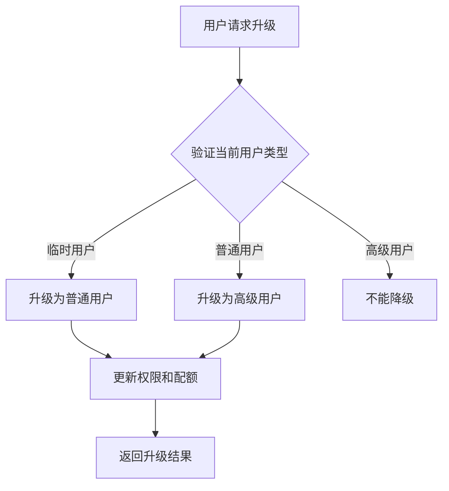

# 用户分类管理API文档

## 接口概述
用户分类管理API提供了完整的用户类型管理、权限验证和配额控制功能，支持临时用户、普通用户、高级用户和管理员四种类型的用户管理。

## 用户类型说明

### 临时用户 (guest)
- **档案配额**: 3个
- **权限范围**: 查看、创建（限制数量）
- **升级方式**: 完成注册流程

### 普通用户 (normal)  
- **档案配额**: 20个
- **权限范围**: 查看、创建
- **升级方式**: 付费购买高级版

### 高级用户 (premium)
- **档案配额**: 无限制
- **权限范围**: 全部功能
- **特殊权益**: 专属客服、优先体验新功能

### 管理员 (admin)
- **档案配额**: 无限制
- **权限范围**: 全部功能 + 系统管理权限
- **特殊权益**: 用户管理、数据管理、系统配置等管理功能

---

## API接口详情

### 1. 升级用户类型

#### 接口名称
升级用户类型，支持从临时用户升级为普通用户，从普通用户升级为高级用户

#### 接口地址
`/userManagement` - action: `upgradeUserType`

#### 请求方式
POST

#### 功能说明


#### 请求参数
```json
{
  "action": "upgradeUserType",
  "data": {
    "targetUserType": "normal",
    "registrationData": {
      "nickName": "张三",
      "gender": 1,
    }
  }
}
```

| 参数名 | 类型 | 必填 | 说明 |
|-----|---|---|---|
| targetUserType | string | 是 | 目标用户类型：guest/normal/premium/admin（注意：只有管理员可以设置管理员权限） |
| registrationData | object | 否 | 注册数据（从临时用户升级时需要） |

#### 返回数据

##### 成功响应
```json
{
  "success": true,
  "message": "用户类型已升级为 normal",
  "data": {
    "oldUserType": "guest",
    "newUserType": "normal", 
    "updateTime": "2024-01-01T12:00:00.000Z",
    "profileQuota": 20,
    "permissions": ["view", "create"]
  }
}
```

##### 返回字段说明
| 字段名 | 类型 | 说明 |
|-----|-----|---|
| success | boolean | 操作是否成功 |
| message | string | 操作结果消息 |
| data.oldUserType | string | 原用户类型 |
| data.newUserType | string | 新用户类型 |
| data.updateTime | string | 升级时间 |
| data.profileQuota | number | 新的档案配额 |
| data.permissions | array | 新的权限列表 |

---

### 2. 检查用户配额

#### 接口名称
检查用户档案配额使用情况

#### 接口地址
`/userManagement` - action: `checkUserQuota`

#### 请求方式
POST

#### 功能说明
实时检查用户的档案创建配额，返回当前使用情况和是否可以创建更多档案。

#### 请求参数
```json
{
  "action": "checkUserQuota"
}
```

#### 返回数据

##### 成功响应
```json
{
  "success": true,
  "data": {
    "userType": "normal",
    "profileQuota": 20,
    "usedProfiles": 5,
    "canCreateMore": true,
    "remainingQuota": 15
  }
}
```

##### 返回字段说明
| 字段名 | 类型 | 说明 |
|-----|-----|---|
| userType | string | 用户类型 |
| profileQuota | number | 总配额（-1表示无限制） |
| usedProfiles | number | 已使用配额 |
| canCreateMore | boolean | 是否可以创建更多 |
| remainingQuota | number | 剩余配额（-1表示无限制） |

---

### 3. 更新已使用档案数量

#### 接口名称
更新用户已使用的档案数量

#### 接口地址
`/userManagement` - action: `updateUsedProfiles`

#### 请求方式
POST

#### 功能说明
用于同步用户的档案使用数量，支持增加或减少。

#### 请求参数
```json
{
  "action": "updateUsedProfiles",
  "data": {
    "increment": 1
  }
}
```

| 参数名 | 类型 | 必填 | 说明 |
|-----|---|---|---|
| increment | number | 是 | 增量（正数增加，负数减少） |

#### 返回数据

##### 成功响应
```json
{
  "success": true,
  "data": {
    "oldUsedProfiles": 5,
    "newUsedProfiles": 6,
    "increment": 1
  }
}
```

---

## 档案管理配额验证

### 创建档案时的配额检查

在调用 `createProfile` 创建档案时，系统会自动进行配额检查：

#### 配额超限响应
```json
{
  "success": false,
  "error": "档案数量已达上限（3个），注册后可创建更多档案",
  "code": "QUOTA_EXCEEDED",
  "data": {
    "userType": "guest",
    "currentCount": 3,
    "quota": 3
  }
}
```

#### 错误码说明
| 错误码 | 说明 | 处理建议 |
|-------|-----|---------|
| QUOTA_EXCEEDED | 配额已满 | 引导用户升级账户类型 |

---

## 权限验证机制

### 客户端权限检查
```javascript
// 使用权限管理器检查权限
const { permissionManager } = require('../../utils/permissionManager');

// 检查是否可以创建档案
if (!permissionManager.canCreateProfile()) {
  // 显示权限不足提示
}


// 检查档案配额
const quotaInfo = permissionManager.canCreateMoreProfiles(currentCount);
if (!quotaInfo.canCreate) {
  // 显示配额超限提示
}
```

### 云函数权限验证
所有敏感操作都在云函数中进行权限验证，确保数据安全。

---

## 使用示例

### 完整的用户升级流程
```javascript
// 1. 检查当前配额
const quotaResult = await userManager.checkUserQuota();
if (!quotaResult.data.canCreateMore) {
  // 2. 显示升级提示并处理用户确认
  const upgradeResult = await userManager.upgradeUserType('normal', {
    nickName: '用户昵称',
    gender: 1
  });
  
  if (upgradeResult.success) {
    // 3. 升级成功，刷新页面状态
    console.log('升级成功，新配额：', upgradeResult.data.profileQuota);
  }
}
```

### 档案创建前的权限检查
```javascript
// 创建档案前检查权限
const canCreate = permissionManager.canCreateProfile();
const quotaInfo = await userManager.checkUserQuota();

if (canCreate && quotaInfo.data.canCreateMore) {
  // 允许创建档案
  await createProfile(profileData);
} else {
  // 显示权限限制提示
  showUpgradeDialog();
}
```

---

## 注意事项

1. **权限验证**: 所有权限检查都应在客户端和云函数双重验证
2. **配额同步**: 档案数量变更时要及时同步到用户配额统计
3. **升级限制**: 高级用户不能降级，需要在业务逻辑中处理
4. **数据一致性**: 用户类型变更后要确保权限和配额的一致性更新

---

**文档版本**: v1.0  
**创建时间**: 2024年  
**最后更新**: 2024年
