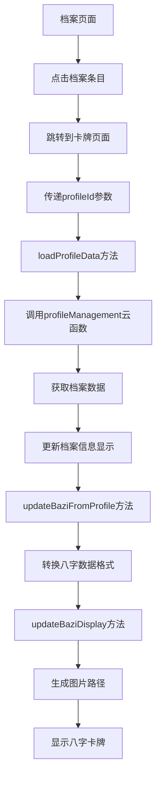
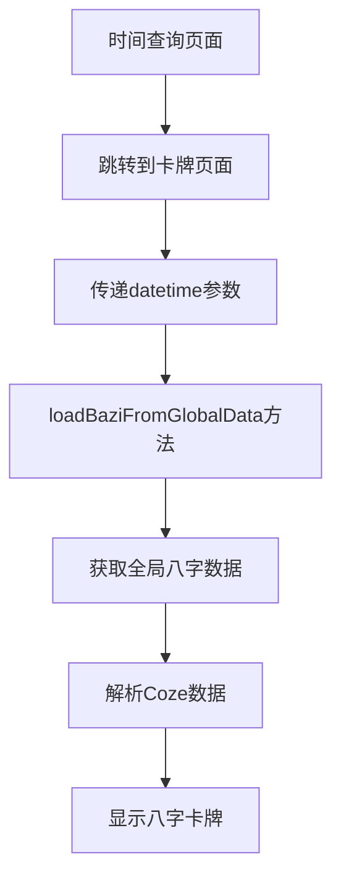

# 八字页面迁移到卡牌页面文档

## 概述
将原有的八字页面(`pages/bazi`)的完整功能迁移到卡牌页面(`pages/card`)，实现从档案页面点击档案条目时跳转到卡牌页面显示对应档案的八字卡牌信息。

## 迁移内容

### 1. JavaScript逻辑迁移
**源文件**: `pages/bazi/index.js` → **目标文件**: `pages/card/index.js`

#### 核心功能保留：
- ✅ 八字图片映射表引用
- ✅ 设备尺寸检测
- ✅ 动画初始化
- ✅ 八字数据解析和显示
- ✅ 图片路径生成
- ✅ 分享功能

#### 新增功能：
- ✅ **档案数据加载**：`loadProfileData()` 方法
- ✅ **档案参数处理**：支持通过 `profileId` 参数加载特定档案
- ✅ **档案信息显示**：档案名称、生日信息展示
- ✅ **加载状态管理**：loading状态和错误处理

#### 兼容性保持：
- ✅ 保留原有的时间参数逻辑（`datetime`, `hasCozeData`）
- ✅ 保留全局数据加载逻辑
- ✅ 保留Coze数据解析功能

### 2. WXML模板迁移
**源文件**: `pages/bazi/index.wxml` → **目标文件**: `pages/card/index.wxml`

#### 新增元素：
- ✅ **加载状态**：loading动画和提示文字
- ✅ **档案信息头部**：显示档案名称和生日信息
- ✅ **干支文字显示**：每个卡牌下方显示对应的天干地支

#### 保留元素：
- ✅ 四柱卡牌布局
- ✅ 卡牌图片显示
- ✅ 动画效果绑定

### 3. 样式迁移和优化
**源文件**: `pages/bazi/index.less` → **目标文件**: `pages/card/index.less`

#### 新增样式：
- ✅ **加载动画**：旋转加载器和文字样式
- ✅ **档案头部**：渐变背景的档案信息展示区域
- ✅ **卡牌优化**：增加背景色、圆角、过渡效果
- ✅ **干支文字**：卡牌下方的天干地支文字样式

#### 保留样式：
- ✅ Grid 2x2 布局
- ✅ 卡牌基础样式
- ✅ 响应式设计

### 4. 配置文件更新
**文件**: `pages/card/index.json`

#### 更新内容：
- ✅ 页面标题：改为"生命智慧卡牌"
- ✅ 下拉刷新：启用下拉刷新功能
- ✅ 组件引用：移除不必要的组件依赖

## 功能流程

### 1. 档案卡牌显示流程


### 2. 兼容性流程（原有功能）


## 数据处理

### 1. 档案数据格式转换
档案数据库格式 → 卡牌显示格式：

```javascript
// 档案数据库格式
{
  baziData: {
    year: { gan: "甲", zhi: "子" },
    month: { gan: "乙", zhi: "丑" },
    day: { gan: "丙", zhi: "寅" },
    hour: { gan: "丁", zhi: "卯" }
  }
}

// 转换为卡牌显示格式
{
  yearPillar: { heavenlyStem: "甲", earthlyBranch: "子" },
  monthPillar: { heavenlyStem: "乙", earthlyBranch: "丑" },
  dayPillar: { heavenlyStem: "丙", earthlyBranch: "寅" },
  timePillar: { heavenlyStem: "丁", earthlyBranch: "卯" }
}
```

### 2. 时间信息格式化
```javascript
// 生日时间格式化
formatBirthTime(birthDate) {
  return `${birthDate.year}年${birthDate.month}月${birthDate.day}日 ${birthDate.hour}:${minute}`;
}

// 农历时间格式化
formatLunarTime(lunarDate) {
  return `农历${lunarDate.year}年${lunarDate.month}月${lunarDate.day}日${lunarDate.isLeap ? '(闰月)' : ''}`;
}
```

## 用户体验优化

### 1. 加载状态
- **加载动画**：旋转的加载器
- **加载文字**：友好的提示信息
- **错误处理**：网络错误和数据错误的用户提示

### 2. 档案信息展示
- **渐变头部**：美观的档案信息展示区域
- **层次信息**：档案名称、公历时间、农历时间的层次展示
- **条件显示**：根据数据可用性智能显示信息

### 3. 卡牌展示优化
- **视觉增强**：卡牌背景色、圆角、阴影效果
- **信息完整**：图片 + 天干地支文字双重展示
- **动画效果**：保留原有的渐入动画

## 导航逻辑更新

### 档案页面跳转逻辑
**修改文件**: `pages/profile/index.js`

```javascript
// 修改前
wx.navigateTo({
  url: `/pages/bazi/index?profileId=${profileId}`
});

// 修改后
wx.navigateTo({
  url: `/pages/card/index?profileId=${profileId}`
});
```

## 技术特点

### 1. 双模式支持
- **档案模式**：通过profileId加载特定档案数据
- **实时模式**：通过全局数据显示实时计算结果

### 2. 数据优先级
```javascript
handleReceivedParams(options) {
  // 优先处理档案ID
  if (profileId) {
    this.loadProfileData();
    return;
  }
  
  // 其次处理时间参数
  if (datetime) {
    // 处理实时计算数据
  }
}
```

### 3. 错误处理
- **网络错误**：Toast提示 + 默认数据显示
- **数据错误**：控制台日志 + 降级处理
- **加载超时**：loading状态管理

## 测试要点

### 1. 功能测试
- ✅ 从档案页面跳转到卡牌页面
- ✅ 档案数据正确加载和显示
- ✅ 八字卡牌图片正确显示
- ✅ 档案信息正确格式化
- ✅ 下拉刷新功能正常

### 2. 兼容性测试
- ✅ 原有时间查询流程正常
- ✅ 全局数据加载正常
- ✅ Coze数据解析正常
- ✅ 分享功能正常

### 3. 异常测试
- ✅ 无效档案ID处理
- ✅ 网络异常处理
- ✅ 数据缺失处理
- ✅ 图片加载失败处理

## 性能优化

### 1. 数据加载
- **按需加载**：只在有profileId时才调用云函数
- **缓存机制**：避免重复加载相同档案
- **错误重试**：网络异常时的降级处理

### 2. 图片加载
- **路径缓存**：生成的图片路径缓存在内存中
- **默认图片**：无效路径时显示默认图片
- **懒加载**：图片按需加载

## 总结

本次迁移成功将八字页面的完整功能迁移到卡牌页面，实现了：

1. **功能完整性**：保留了所有原有功能
2. **用户体验**：增强了加载状态和信息展示
3. **数据流畅**：实现了档案到卡牌的无缝跳转
4. **兼容性**：保持了原有流程的正常工作
5. **扩展性**：为后续功能扩展预留了空间

现在用户可以在档案页面点击任意档案条目，直接跳转到卡牌页面查看对应的生辰八字卡牌信息，提供了更加直观和流畅的用户体验。
