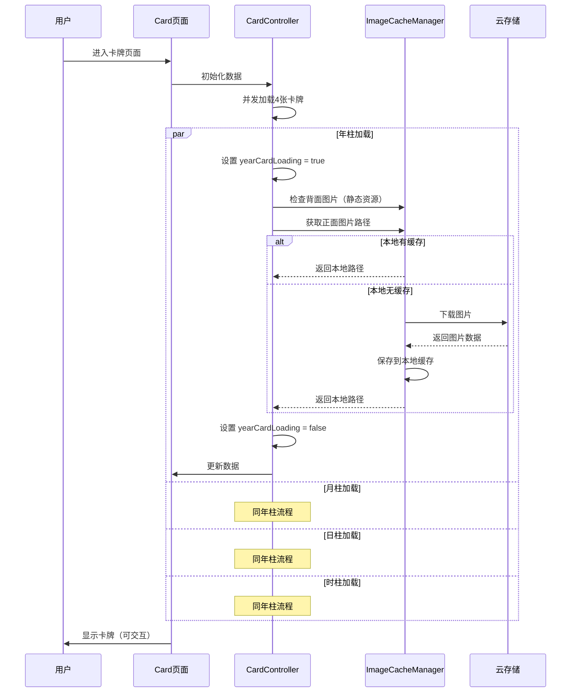

# 卡牌加载问题修复说明

## 问题描述

在提交 `7e90eeacfd6bfd41ce71ef3cf9b79f0e33fe3131` 中，card 页面的卡牌图片一直显示加载中，无法正常显示。

## 问题原因

### 旧版本（829bbc1）的实现逻辑
- 使用全局的 `isLoadingImages` 状态控制所有卡牌的加载状态
- 图片加载完成后，通过 `bindload` 事件取消加载状态

### 新版本（7e90eea）的实现逻辑
- 改为每张卡牌独立的加载状态（`yearCardLoading`, `monthCardLoading` 等）
- 依赖 `bindload` 事件来取消每张卡牌的加载状态
- **核心问题**：
  1. 背面图片是静态资源（`/static/card-back.jpg`），会立即触发 `bindload`
  2. 但此时正面图片可能还在后台下载缓存中
  3. `bindload` 事件过早取消了 loading 状态
  4. 导致用户看到的是一直在转圈的加载状态

## 业务需求

每一柱在显示加载状态时需要完成两件事：
1. 检查本地是否有卡牌背面图片
2. 检查本地是否有当前柱的卡牌正面图片
3. 如果没有，从云端下载到本地缓存
4. **完成以上步骤后才能取消加载状态**，此时才能响应用户的点击事件

## 修复方案

### 核心改动

修改 `CardController.js` 中的 `_loadSingleCard` 方法：

```javascript
async _loadSingleCard(pillarConfig, cardBackImagePath) {
  // 1. 设置加载状态
  this._setData({ [`${name}CardLoading`]: true });
  
  // 2. 验证背面图片（静态资源，直接可用）
  
  // 3. 获取并缓存正面图片（云存储资源）
  imagePath = await imageCacheManager.getImagePath(imageInfo.cloudPath, imageInfo.fileName);
  
  // 4. 所有图片准备完成后，才取消loading状态
  this._setData({ 
    [`${name}Pillar`]: { ... },
    [`${name}CardLoading`]: false  // 在此处取消loading
  });
}
```

### 关键点

1. **不再依赖 `bindload` 事件来控制 loading 状态**
   - `bindload` 只用于日志记录
   - loading 状态由 `_loadSingleCard` 方法统一管理

2. **确保图片缓存完成后才取消 loading**
   - 使用 `await imageCacheManager.getImagePath()` 等待缓存完成
   - 这个方法会自动检查本地缓存，如果没有则下载
   - 只有完成后才执行后续的 `setData` 取消 loading

3. **异步并发加载保持不变**
   - 四张卡牌仍然是并发加载，提高效率
   - 每张卡牌独立完成自己的加载流程

## 修复后的流程



## 测试验证

修复后需要验证：

1. ✅ 卡牌加载时显示 loading 状态
2. ✅ 正面图片缓存完成后，loading 状态自动消失
3. ✅ 用户可以点击卡牌进行翻转
4. ✅ 四张卡牌独立加载，互不影响
5. ✅ 首次加载会下载图片，第二次使用缓存（更快）

## 相关文件

- `miniprogram/controllers/CardController.js` - 核心修复
- `miniprogram/pages/card/index.js` - 页面逻辑（无需修改）
- `miniprogram/pages/card/index.wxml` - 视图层（无需修改）
- `miniprogram/utils/imageCacheManager.js` - 图片缓存管理器

## 注意事项

1. **不要回退到旧版本的全局 loading 逻辑**
   - 新版本的独立加载状态更精准
   - 可以更好地控制每张卡牌的状态

2. **确保 imageCacheManager 正常工作**
   - 如果缓存管理器有问题，可能导致加载失败
   - 需要检查云存储权限和网络状态

3. **保持异步并发加载**
   - 不要改为串行加载，会降低性能
   - 四张卡牌并发加载是正确的设计

