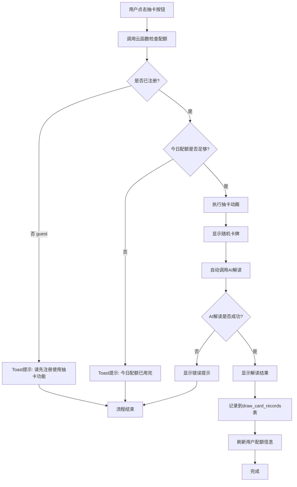

# 抽卡配额限制系统设计方案

## 一、功能概述

为抽卡功能增加使用限制，确保只有已注册用户可以使用，并根据用户类型限制每日使用次数。

## 二、核心需求

1. **用户身份验证**：只有已注册用户（非guest）才能使用抽卡功能
2. **每日配额限制**：每个用户类型有不同的每日抽卡次数限制
3. **使用记录**：记录用户的每次抽卡，包括问题、卡牌、AI解读结果和时间

## 三、业务规则

### 3.1 配额规则

| 用户类型 | 每日配额 | 说明 |
|---------|---------|------|
| guest（临时用户） | 0次 | 不可使用抽卡功能，需要先注册 |
| normal（普通用户） | 3次 | 每天可抽卡3次 |
| premium（高级用户） | 无限 | 不限制使用次数 |

### 3.2 计次规则

- **抽卡操作本身不计次**：用户可以随意抽卡查看卡牌
- **AI解读计次**：只有当用户获取AI解读结果后才计入配额
- **记录时机**：AI解读成功返回后，记录到 `draw_card_records` 表

### 3.3 检查时机

- **前置检查**：用户点击"抽卡"按钮时，检查用户身份和配额
- **后置记录**：AI解读成功后，记录使用历史

## 四、完整流程



## 五、数据表设计

### 5.1 修改 `static_user_types` 表

新增字段 `dailyDrawQuota` 用于配置每日抽卡配额。

**字段定义：**

| 字段名 | 类型 | 说明 |
|--------|------|------|
| dailyDrawQuota | number | 每日抽卡配额：0=不可用，正整数=次数限制，-1=无限 |

**配置示例：**

```json
{
  "typeCode": "guest",
  "typeName": "临时用户",
  "dailyDrawQuota": 0
}

{
  "typeCode": "normal",
  "typeName": "探索者",
  "dailyDrawQuota": 3
}

{
  "typeCode": "premium",
  "typeName": "高级用户",
  "dailyDrawQuota": -1
}
```

### 5.2 新建 `draw_card_records` 表

记录用户的每次抽卡和AI解读历史。

详见：[draw_card_recordsdb.md](./database/draw_card_recordsdb.md)

## 六、云函数设计

### 6.1 新建云函数 `drawCardManagement`

**功能：**
1. 检查用户配额（checkQuota）
2. 记录抽卡历史（recordDraw）

**详细接口文档：**
详见：[drawCardManagement-api.md](./api/drawCardManagement-api.md)

### 6.2 接口概览

#### 检查配额接口

**请求：**
```javascript
{
  action: 'checkQuota'
}
```

**返回（成功）：**
```javascript
{
  success: true,
  data: {
    canDraw: true,              // 是否可以抽卡
    userTypeCode: "normal",     // 用户类型
    remainingQuota: 2,          // 今日剩余次数（-1表示无限）
    totalQuota: 3,              // 每日总配额
    usedToday: 1                // 今日已使用次数
  }
}
```

**返回（失败）：**
```javascript
{
  success: false,
  error: "今日抽卡次数已用完",
  code: 1003,                    // 错误码
  data: {
    canDraw: false,
    userTypeCode: "normal",
    remainingQuota: 0,
    totalQuota: 3,
    usedToday: 3
  }
}
```

**错误码：**
- `1001`：未注册用户（guest）
- `1002`：用户类型不支持抽卡功能
- `1003`：今日配额已用完
- `-1`：系统错误

#### 记录抽卡接口

**请求：**
```javascript
{
  action: 'recordDraw',
  data: {
    question: "我今年的事业运势如何？",
    cardNumber: 15,
    cardName: "戊寅",
    aiAnswer: "根据戊寅的特性..."
  }
}
```

**返回：**
```javascript
{
  success: true,
  message: "记录成功"
}
```

## 七、客户端实现要点

### 7.1 页面加载时

```javascript
async onLoad(options) {
  // 预加载用户配额信息
  await this._loadUserQuota();
}
```

### 7.2 点击抽卡按钮

```javascript
async onAnalyzeAnswer() {
  // 1. 检查配额
  const quotaCheck = await this._checkDrawQuota();
  if (!quotaCheck.canDraw) {
    this._showQuotaError(quotaCheck);
    return;
  }
  
  // 2. 执行抽卡逻辑
  // ...
}
```

### 7.3 AI解读完成后

```javascript
async onAIInterpret() {
  // 1. 调用AI解读
  const result = await wx.cloud.callFunction({ ... });
  
  // 2. 显示结果
  this.setData({ aiInterpretation: result.result.data });
  
  // 3. 记录历史
  await this._recordDrawHistory(card, question, aiAnswer);
  
  // 4. 刷新配额
  await this._loadUserQuota();
}
```

### 7.4 错误提示

根据错误码显示不同的Toast提示：

| 错误码 | 提示内容 |
|-------|---------|
| 1001 | 请先注册后使用抽卡功能 |
| 1002 | 您当前的用户类型不支持抽卡功能 |
| 1003 | 今日抽卡次数已用完（3次/天），明天再来吧~ |
| 其他 | 暂时无法使用抽卡功能 |

## 八、实施步骤

### 8.1 数据库准备

1. 在 `static_user_types` 表中添加 `dailyDrawQuota` 字段
2. 为现有的三种用户类型配置配额值
3. 创建 `draw_card_records` 集合
4. 为 `draw_card_records` 创建索引：
   - `userId` + `drawDate` 复合索引
   - `openid` 普通索引
   - `interpretTime` 普通索引

### 8.2 云函数开发

1. 创建云函数 `drawCardManagement`
2. 实现 `checkQuota` 接口
3. 实现 `recordDraw` 接口
4. 部署并测试

### 8.3 客户端开发

1. 修改 `pages/answer/index.js`
2. 添加配额检查逻辑
3. 添加记录逻辑
4. 添加错误提示
5. 测试完整流程

### 8.4 测试验证

1. **未注册用户测试**：
   - guest用户点击抽卡 → 提示需要注册
   
2. **配额限制测试**：
   - normal用户抽卡3次 → 第4次提示配额用完
   - premium用户抽卡多次 → 不受限制
   
3. **记录验证测试**：
   - 检查 `draw_card_records` 表是否正确记录
   - 验证记录的时间、卡牌、问题、答案是否完整
   
4. **跨天测试**：
   - 验证次日配额是否重置

## 九、扩展性考虑

### 9.1 未来可能的功能

1. **抽卡历史展示**
   - 在个人中心显示用户的抽卡历史
   - 可查看历史问题和AI解读结果
   
2. **配额购买**
   - 允许用户购买额外的抽卡次数
   - 记录购买历史和使用情况
   
3. **统计分析**
   - 用户抽卡行为分析
   - 热门问题统计
   - 卡牌抽取频率统计
   
4. **分享功能**
   - 用户可以分享抽卡结果
   - 被分享者获得额外抽卡次数奖励

### 9.2 数据库扩展

如需实现上述功能，可以考虑：

1. 在 `users` 表添加 `extraDrawQuota` 字段（额外配额）
2. 在 `draw_card_records` 表添加 `isShared` 字段（是否已分享）
3. 新建 `quota_purchase_records` 表（配额购买记录）

## 十、注意事项

1. **数据一致性**：配额检查在云函数中进行，确保安全性
2. **错误处理**：记录失败不影响用户体验，静默处理
3. **性能优化**：配额信息在页面加载时预加载，减少等待时间
4. **用户体验**：提示信息清晰友好，引导用户注册或升级
5. **时区问题**：使用 UTC 时间，按日期（YYYY-MM-DD）统计，避免时区差异

## 十一、相关文档

- [draw_card_recordsdb.md](./database/draw_card_recordsdb.md) - 抽卡记录表设计
- [user_typesdb.md](./database/user_typesdb.md) - 用户类型表（包含配额字段）
- [drawCardManagement-api.md](./api/drawCardManagement-api.md) - 云函数接口文档

