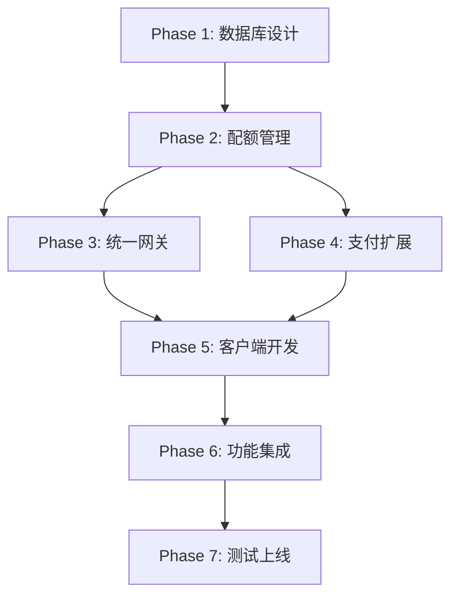

# 功能按次付费系统实施计划

## 📋 目录

1. [整体规划](#整体规划)
2. [Phase 1: 数据库设计与初始化](#phase-1-数据库设计与初始化)
3. [Phase 2: 配额管理云函数](#phase-2-配额管理云函数)
4. [Phase 3: 统一调用网关](#phase-3-统一调用网关)
5. [Phase 4: 支付系统扩展](#phase-4-支付系统扩展)
6. [Phase 5: 客户端开发](#phase-5-客户端开发)
7. [Phase 6: 功能集成](#phase-6-功能集成)
8. [Phase 7: 测试与上线](#phase-7-测试与上线)
9. [风险控制](#风险控制)
10. [验收标准](#验收标准)

---

## 整体规划

### 开发周期

**预计总时长**：10-12个工作日

### 里程碑

```
Week 1:
├─ Day 1-2: Phase 1 数据库设计与初始化
├─ Day 3-4: Phase 2 配额管理云函数
└─ Day 5:   Phase 3 统一调用网关

Week 2:
├─ Day 6-7: Phase 4 支付系统扩展
├─ Day 8-9: Phase 5 客户端开发 + Phase 6 功能集成
└─ Day 10:  Phase 7 测试与上线
```

### 技术栈

- **云函数**: Node.js + wx-server-sdk
- **数据库**: 微信云开发NoSQL数据库
- **客户端**: 小程序 + 现有架构（Service + Controller）

### 依赖关系



---

## Phase 1: 数据库设计与初始化

### 🎯 目标

创建功能付费系统所需的数据库表和配置数据

### 📝 任务清单

#### 1.1 创建数据库文档

- [x] **创建 `function_products_db.md`** ✅
  - 位置：`docs/database/function_productsdb.md`
  - 内容：功能商品表的完整结构定义
  - 包含：字段说明、索引设计、数据示例
  - **状态**：已完成

- [x] **创建 `function_quotas_db.md`** ✅
  - 位置：`docs/database/function_quotasdb.md`
  - 内容：用户功能配额表的结构定义
  - 包含：字段说明、索引设计、配额计算逻辑
  - **状态**：已完成

- [x] **创建 `function_usage_records_db.md`** ✅
  - 位置：`docs/database/function_usage_recordsdb.md`
  - 内容：功能使用记录表的结构定义
  - 包含：字段说明、索引设计、统计查询示例
  - **状态**：已完成

- [x] **更新 `payment_orders_db.md`** ✅
  - 新增：功能付费相关字段（`orderType`, `functionCode`, `grantInfo`）
  - 更新：字段说明和示例数据
  - **状态**：已完成

- [x] **更新 `user_types_db.md`** ✅
  - 更新：字段复用说明（智慧洞见复用 `dailyDrawQuota`，新增 `dailyAiReportQuota`）
  - 更新：字段说明和配置示例
  - **配置值**：guest=0次, normal=1次/天, premium=无限
  - **状态**：已完成

#### 1.2 准备初始化数据

- [x] **创建商品初始化脚本** ✅
  - 文件：`docs/tools/init_function_products.js`（独立版本）
  - 云函数：`cloudfunctions/tempInitFunctionPayment/index.js`（推荐使用）
  - 内容：初始化 2 个功能商品（智慧洞见、AI出报告）
  - 包含：完整的 `callConfig` 和 `grantData` 配置
  - **状态**：已完成

```javascript
// 初始化数据示例
const products = [
  {
    functionCode: "wisdom_insight",
    functionName: "智慧洞见",
    functionType: "per_use",
    description: "AI智慧洞见，每次使用付费",
    price: 190,  // 1.9元
    originalPrice: 190,
    callConfig: {
      targetFunction: "cozeFunctions_v1_3",
      targetAction: null,
      workflowType: "WISDOM_INSIGHT",
      parameters: {}
    },
    grantData: {
      type: "grant_function_quota",
      functionCode: "wisdom_insight",
      quantity: 1
    },
    status: "active",
    sortOrder: 1,
    createTime: new Date(),
    updateTime: new Date()
  },
  {
    functionCode: "ai_report",
    functionName: "AI出报告",
    functionType: "per_use",
    description: "AI深度解读卡牌，生成专业报告",
    price: 990,  // 9.9元
    originalPrice: 990,
    callConfig: {
      targetFunction: "cozeFunctions_v1_3",
      targetAction: null,
      workflowType: "AI_REPORT",
      parameters: {}
    },
    grantData: {
      type: "grant_function_quota",
      functionCode: "ai_report",
      quantity: 1
    },
    status: "active",
    sortOrder: 2,
    createTime: new Date(),
    updateTime: new Date()
  }
];
```

- [x] **创建用户类型配置脚本** ✅
  - 文件：`docs/tools/update_user_types_config.js`（独立版本）
  - 云函数：`cloudfunctions/tempInitFunctionPayment/index.js`（推荐使用）
  - 内容：为所有用户类型添加 `dailyAiReportQuota` 字段
  - **重要**：智慧洞见复用现有的 `dailyDrawQuota` 字段，不新增字段
  - **配置值**：
    - guest: dailyDrawQuota=0（不可用）, dailyAiReportQuota=0（不可用）
    - normal: dailyDrawQuota=1次/天, dailyAiReportQuota=1次/天
    - premium: dailyDrawQuota=-1（无限）, dailyAiReportQuota=-1（无限）
  - **状态**：已完成

#### 1.3 执行数据库初始化

- [x] **云端创建数据库集合** ✅
  - 集合名：`function_products`
  - 权限设置：仅管理端可读写
  - 索引：`functionCode` (唯一索引), `status`
  - **状态**：已完成，数据已初始化

- [ ] **云端创建数据库集合** ⏳
  - 集合名：`function_quotas`
  - 权限设置：仅管理端可读写
  - 索引：`openid` (唯一索引) ⚠️ **必须创建**, `userId` (普通索引)
  - **状态**：待执行

- [ ] **云端创建数据库集合** ⏳
  - 集合名：`function_usage_records`
  - 权限设置：仅管理端可读写
  - 索引：`openid`, `functionCode`, `usageTime` (降序), `usageDate`, `orderId`
  - **状态**：待执行

- [x] **导入初始化数据** ✅（部分完成）
  - ✅ 执行商品初始化脚本 - 已完成，商品数据验证通过
  - ⏳ 更新用户类型配置 - 待执行（需要执行 `updateUserTypes` action）
  - **下一步**：执行云函数 `tempInitFunctionPayment`，action: `updateUserTypes`

### ✅ 验收标准

- [x] 所有数据库文档已创建并提交到 `docs/database/` ✅
  - function_productsdb.md ✅
  - function_quotasdb.md ✅
  - function_usage_recordsdb.md ✅
  - payment_ordersdb.md（已更新）✅
  - user_typesdb.md（已更新）✅

- [x] 初始化脚本可正常运行 ✅
  - tempInitFunctionPayment 云函数已创建 ✅
  - 支持一键初始化和分步执行 ✅

- [x] 云端数据库集合已创建，索引已设置 ✅
  - function_products ✅ 已创建并初始化
  - function_quotas ✅ 已创建（唯一索引：openid）
  - function_usage_records ✅ 已创建（多个索引）

- [x] 商品数据已导入，查询正常 ✅
  - 智慧洞见（1.9元）✅
  - AI出报告（9.9元）✅
  - 验证通过 ✅

- [x] 用户类型配置已更新 ✅
  - ✅ 已执行 `updateUserTypes` action
  - ✅ `dailyAiReportQuota` 字段已添加
  - ✅ 配置值正确：
    - guest: dailyDrawQuota=0, dailyAiReportQuota=0
    - normal: dailyDrawQuota=1, dailyAiReportQuota=1
  - ⚠️ 注意：当前只有 guest 和 normal 两个用户类型（premium 类型未创建）

### ⏱️ 预计工时

**2个工作日**

### 📊 Phase 1 当前进度

**完成度：100%** ✅

#### ✅ 已完成任务
1. ✅ **数据库文档**（5个文档全部完成）
   - function_productsdb.md ✅
   - function_quotasdb.md ✅
   - function_usage_recordsdb.md ✅
   - payment_ordersdb.md（已更新功能付费字段）✅
   - user_typesdb.md（已更新字段复用说明）✅

2. ✅ **初始化脚本**（tempInitFunctionPayment 云函数）
   - 支持一键初始化（`initAll`）✅
   - 支持分步执行和验证 ✅
   - 自动检测用户类型表名 ✅
   - 智能跳过已存在数据 ✅

3. ✅ **数据库集合创建**（全部完成）
   - function_products ✅ 已创建并初始化
   - function_quotas ✅ 已创建（唯一索引：openid）
   - function_usage_records ✅ 已创建（多个索引）

4. ✅ **商品数据初始化**
   - 智慧洞见（1.9元/次）✅ 已导入并验证通过
   - AI出报告（9.9元/次）✅ 已导入并验证通过

5. ✅ **字段复用方案确认**
   - 智慧洞见复用 `dailyDrawQuota` 字段 ✅
   - 配置值已更新：guest=0, normal=1 ✅

6. ✅ **用户类型配置更新**
   - 已执行 `updateUserTypes` action ✅
   - `dailyAiReportQuota` 字段已添加 ✅
   - 配置验证通过 ✅
   - guest: dailyDrawQuota=0, dailyAiReportQuota=0 ✅
   - normal: dailyDrawQuota=1, dailyAiReportQuota=1 ✅

7. ✅ **完整验证**
   - 商品数据验证通过 ✅
   - 用户类型配置验证通过 ✅
   - 所有数据完整性检查通过 ✅

#### ⚠️ 注意事项
- 当前只有 `guest` 和 `normal` 两个用户类型
- 如果后续需要 `premium` 用户类型，需要手动创建：
  ```json
  {
    "typeCode": "premium",
    "typeName": "高级用户",
    "displayName": "高级用户",
    "dailyDrawQuota": -1,
    "dailyAiReportQuota": -1,
    // ... 其他字段
  }
  ```

#### 🎉 Phase 1 完成总结
- ✅ 所有数据库文档已创建
- ✅ 所有数据库集合已创建并设置索引
- ✅ 商品数据已初始化并验证通过
- ✅ 用户类型配置已更新并验证通过
- ✅ 所有验收标准已达成

**Phase 1 状态：已完成** ✅

**下一步：进入 Phase 2 - 配额管理云函数开发**

---

## Phase 2: 配额管理云函数

### 🎯 目标

实现独立的配额管理云函数，负责配额检查、扣除、发放、回滚

### 📝 任务清单

#### 2.1 创建云函数项目

- [x] **创建云函数目录** ✅
  - 路径：`cloudfunctions/functionQuotaManagement_v1_4/`
  - 文件：`index.js`, `package.json`, `README.md`

- [x] **配置 package.json** ✅
  ```json
  {
    "name": "functionQuotaManagement_v1_4",
    "version": "1.4.0",
    "description": "功能配额管理云函数",
    "main": "index.js",
    "dependencies": {
      "wx-server-sdk": "~2.6.3"
    }
  }
  ```

#### 2.2 实现核心功能

- [x] **实现 checkQuota（检查配额）** ✅
  - 功能：检查用户某个功能的可用配额
  - 逻辑：
    1. 从 `static_user_types` 获取用户类型的免费配额配置
    2. 从 `function_usage_records` 统计当日已使用的免费次数
    3. 从 `function_quotas` 获取用户的付费配额
    4. 计算总可用配额 = (免费配额 - 已使用) + 付费配额
  - 返回：
    ```javascript
    {
      success: true,
      data: {
        canUse: true,
        freeRemaining: 2,      // 免费剩余
        paidRemaining: 5,      // 付费剩余
        totalRemaining: 7,     // 总剩余
        freeDailyQuota: 3,     // 每日免费配额
        freeUsedToday: 1       // 今日已用免费次数
      }
    }
    ```

- [x] **实现 deductQuota（扣除配额）** ✅
  - 功能：扣除用户配额（原子操作）
  - 逻辑：
    1. 先检查配额是否充足
    2. 优先扣除免费配额（插入使用记录，isPaid=false）
    3. 免费配额用完后扣除付费配额（更新 function_quotas，isPaid=true）
    4. 使用数据库原子操作（`db.command.inc(-1)`）
  - 返回：
    ```javascript
    {
      success: true,
      data: {
        isPaid: false,  // 本次使用免费配额
        quotaBefore: { freeRemaining: 2, paidRemaining: 5 },
        quotaAfter: { freeRemaining: 1, paidRemaining: 5 }
      }
    }
    ```

- [x] **实现 grantQuota（发放配额）** ✅
  - 功能：发放付费配额（支付成功后调用）
  - 逻辑：
    1. 检查用户是否已有配额记录
    2. 如果没有，创建新记录
    3. 如果有，使用原子操作增加配额（`db.command.inc(+quantity)`）
  - 参数：
    ```javascript
    {
      functionCode: 'wisdom_insight',
      quantity: 1,
      orderId: 'order_xxx'  // 可选
    }
    ```

- [x] **实现 rollbackQuota（回滚配额）** ✅
  - 功能：功能调用失败时回滚配额
  - 逻辑：
    1. 如果 isPaid=false，删除刚插入的使用记录
    2. 如果 isPaid=true，恢复付费配额（`db.command.inc(+quantity)`）
  - 参数：
    ```javascript
    {
      functionCode: 'wisdom_insight',
      quantity: 1,
      isPaid: false
    }
    ```

- [x] **实现 getQuotaInfo（查询配额信息）** ✅
  - 功能：获取用户的配额信息（用于显示）
  - 逻辑：
    1. 如果传入 functionCode，返回该功能的配额
    2. 如果不传，返回所有功能的配额
  - 返回：配额详情（包括免费配额和付费配额）

#### 2.3 添加辅助函数

- [x] **getUserTypeConfig（获取用户类型配置）** ✅
  - 从 `static_user_types` 表获取用户类型的配额配置
  - 支持缓存机制（5分钟缓存）

- [x] **getTodayUsageCount（统计今日使用次数）** ✅
  - 从 `function_usage_records` 表统计当日免费使用次数
  - 参数：openid, functionCode, usageDate

- [x] **统一错误处理** ✅
  - 所有接口返回统一格式：`{ success, data, error, code }`
  - 详细的错误日志记录

#### 2.4 创建接口文档

- [x] **创建 API 文档** ✅
  - 位置：`docs/api/functionQuotaManagementAPI.md`
  - 内容：
    - 接口列表
    - 每个接口的参数、返回值、示例
    - 错误码说明
    - 使用示例

- [x] **创建 README** ✅
  - 位置：`cloudfunctions/functionQuotaManagement_v1_4/README.md`
  - 内容：
    - 功能说明
    - 接口概览
    - 配额计算逻辑
    - 注意事项

### ✅ 验收标准

- [x] 云函数代码完成，通过代码审查 ✅
- [ ] 所有接口测试通过 ⏳（待部署后测试）
- [x] 配额检查逻辑正确（免费+付费）✅
- [x] 扣除配额使用原子操作，无并发问题 ✅
- [x] 回滚配额逻辑正确 ✅
- [x] API 文档完整 ✅
- [x] 错误处理完善，日志清晰 ✅

### 🧪 测试用例

1. **测试配额检查**
   - 免费配额充足
   - 免费配额用完，付费配额充足
   - 所有配额用完

2. **测试配额扣除**
   - 优先扣除免费配额
   - 免费配额用完后扣除付费配额
   - 并发扣除（多个请求同时扣除）

3. **测试配额发放**
   - 首次发放（创建记录）
   - 追加发放（更新记录）

4. **测试配额回滚**
   - 回滚免费配额（删除使用记录）
   - 回滚付费配额（恢复配额）

### ⏱️ 预计工时

**2个工作日**

### 📊 Phase 2 当前进度

**完成度：100%** ✅

#### ✅ 已完成任务

1. ✅ **云函数项目创建**
   - 创建 functionQuotaManagement_v1_4 目录 ✅
   - 配置 package.json ✅

2. ✅ **核心功能实现**（5个接口全部完成）
   - checkQuota（检查配额）✅
   - deductQuota（扣除配额）✅
   - grantQuota（发放配额）✅
   - rollbackQuota（回滚配额）✅
   - getQuotaInfo（查询配额信息）✅

3. ✅ **辅助函数实现**
   - getUserTypeConfig（配置缓存）✅
   - getUserInfo（获取用户信息）✅
   - getTodayUsageCount（统计使用次数）✅
   - getPaidQuota（获取付费配额）✅
   - getQuotaFieldName（字段映射）✅
   - success/error（统一响应格式）✅

4. ✅ **文档创建**
   - README.md（详细功能说明）✅
   - API 文档（完整接口文档）✅

#### ✨ 核心特性

1. **配额优先级**
   - ✅ 优先扣除免费配额
   - ✅ 免费用完后扣除付费配额

2. **并发安全**
   - ✅ 使用原子操作（db.command.inc）
   - ✅ 条件更新防止超扣

3. **性能优化**
   - ✅ 用户类型配置缓存（5分钟）
   - ✅ 减少数据库查询次数

4. **错误处理**
   - ✅ 统一错误码
   - ✅ 详细错误日志
   - ✅ 友好错误提示

5. **功能支持**
   - ✅ 智慧洞见（复用 dailyDrawQuota）
   - ✅ AI出报告（使用 dailyAiReportQuota）
   - ✅ 易于扩展新功能

#### ⏳ 待完成任务

- [x] **云函数部署** ✅
  - 上传到云端 ✅
  - 云端安装依赖 ✅
  - **状态**：已完成

- [ ] **接口测试** ⏳
  - 测试所有 5 个接口
  - 并发测试
  - 边界条件测试
  - **测试工具**：`docs/tools/test-quota-management.js` ✅
  - **测试指南**：`docs/function-quota-management-test-guide.md` ✅
  - **测试工具**：`docs/tools/test-quota-management.js` ✅
  - **测试指南**：`docs/function-quota-management-test-guide.md` ✅

#### 🎉 Phase 2 完成总结

- ✅ 云函数代码已完成（约 700 行）
- ✅ 5 个核心接口全部实现
- ✅ 辅助函数完整
- ✅ 原子操作保证并发安全
- ✅ 配置缓存优化性能
- ✅ 错误处理完善
- ✅ 文档完整（README + API 文档）
- ✅ 代码符合项目规范

**Phase 2 状态：开发完成，已部署，待测试验证** ✅

**测试工具已准备：**
- ✅ 测试脚本：`docs/tools/test-quota-management.js`
- ✅ 测试指南：`docs/function-quota-management-test-guide.md`

**下一步：**
1. ✅ 云函数已部署到云端
2. ⏳ **执行接口测试**（使用测试工具验证所有接口）
3. ⏳ 测试通过后进入 Phase 3

---

## Phase 3: 统一调用网关

### 🎯 目标

实现统一调用网关，负责权限检查、配额检查、功能调用、使用记录

### 📝 任务清单

#### 3.1 创建云函数项目

- [ ] **创建云函数目录**
  - 路径：`cloudfunctions/functionCallGateway_v1_4/`
  - 文件：`index.js`, `package.json`, `README.md`

#### 3.2 实现核心功能

- [ ] **实现 callFunction（统一调用接口）**
  - 功能：统一的功能调用入口
  - 流程：
    1. 验证参数（functionCode 必填）
    2. 从 `function_products` 查询功能配置
    3. 检查用户权限（调用 checkUserPermission）
    4. 检查配额（调用 functionQuotaManagement.checkQuota）
    5. 扣除配额（调用 functionQuotaManagement.deductQuota）
    6. 调用目标功能云函数（根据 callConfig）
    7. 记录使用记录（调用 recordFunctionUsage）
    8. 如果失败，回滚配额（调用 functionQuotaManagement.rollbackQuota）
  - 参数：
    ```javascript
    {
      action: 'callFunction',
      data: {
        functionCode: 'wisdom_insight',
        functionParams: {
          parameters: {
            question: '我应该换工作吗？'
          }
        }
      }
    }
    ```
  - 返回：
    ```javascript
    {
      success: true,
      data: { /* 功能返回的结果 */ },
      quotaInfo: { /* 配额信息 */ },
      isPaid: false  // 是否付费使用
    }
    ```

- [ ] **实现 checkUserPermission（权限检查）**
  - 功能：检查用户是否有权限使用该功能
  - 逻辑：
    1. 获取用户信息（从 users 表）
    2. 获取用户类型配置
    3. 检查功能权限（可扩展）
  - 返回：`{ allowed: true/false, message: '', userType: '' }`

- [ ] **实现 recordFunctionUsage（记录使用）**
  - 功能：记录每次功能使用
  - 逻辑：
    1. 插入使用记录到 `function_usage_records`
    2. 包含：functionCode, usageData, result, isPaid, quotaBefore, quotaAfter
  - 说明：记录失败不影响主流程

- [ ] **实现目标云函数调用逻辑**
  - 根据 `callConfig.targetFunction` 调用云函数
  - 根据 `callConfig.workflowType` 传递参数
  - 合并 `callConfig.parameters`（默认参数）和 `functionParams`（用户参数）
  - 处理返回结果，统一格式

#### 3.3 错误处理

- [ ] **定义错误码**
  - `INVALID_PARAMS`：参数错误
  - `FUNCTION_NOT_FOUND`：功能不存在
  - `INVALID_CONFIG`：配置错误
  - `PERMISSION_DENIED`：无权限
  - `CHECK_QUOTA_FAILED`：检查配额失败
  - `QUOTA_INSUFFICIENT`：配额不足
  - `DEDUCT_QUOTA_FAILED`：扣除配额失败
  - `FUNCTION_CALL_FAILED`：功能调用失败
  - `INTERNAL_ERROR`：内部错误

- [ ] **实现统一错误处理**
  - 所有错误返回统一格式
  - 记录详细的错误日志
  - 关键错误发送告警（可选）

#### 3.4 创建文档

- [ ] **创建 API 文档**
  - 位置：`docs/api/functionCallGatewayAPI.md`
  - 内容：接口说明、参数、返回值、错误码、示例

- [ ] **创建 README**
  - 位置：`cloudfunctions/functionCallGateway_v1_4/README.md`
  - 内容：功能说明、使用流程、注意事项

### ✅ 验收标准

- [ ] 统一网关代码完成，通过代码审查
- [ ] 配额不足时正确返回错误码 `QUOTA_INSUFFICIENT`
- [ ] 权限检查正确
- [ ] 功能调用成功时配额正确扣除
- [ ] 功能调用失败时配额正确回滚
- [ ] 使用记录正确插入
- [ ] 错误处理完善
- [ ] API 文档完整

### 🧪 测试用例

1. **测试配额不足**
   - 返回 `QUOTA_INSUFFICIENT` 错误
   - 返回配额信息

2. **测试权限不足**
   - 返回 `PERMISSION_DENIED` 错误

3. **测试功能调用成功**
   - 配额正确扣除
   - 使用记录正确插入
   - 返回功能结果

4. **测试功能调用失败**
   - 配额正确回滚
   - 返回错误信息

5. **测试无效参数**
   - 缺少 functionCode
   - functionCode 不存在
   - 功能配置错误

### ⏱️ 预计工时

**1个工作日**

---

## Phase 4: 支付系统扩展

### 🎯 目标

扩展现有支付系统，支持功能付费订单创建和权益发放

### 📝 任务清单

#### 4.1 扩展支付云函数

- [ ] **新增 createFunctionOrder 接口**
  - 功能：创建功能付费订单
  - 参数：`{ functionCode: 'wisdom_insight' }`
  - 逻辑：
    1. 验证 functionCode
    2. 从 `function_products` 查询商品信息
    3. 创建订单（orderType='function_payment'）
    4. 快照商品信息到订单（price, grantData, callConfig）
    5. 初始化 grantInfo（status='pending'）
    6. 调用微信支付统一下单
    7. 返回支付参数
  - 位置：`cloudfunctions/paymentManagement_v1_3/index.js`

- [ ] **扩展 handlePaymentSuccess（支付成功处理）**
  - 新增 case：`grant_function_quota`
  - 逻辑：
    1. 从订单的 grantData 获取 functionCode 和 quantity
    2. 调用 `functionQuotaManagement.grantQuota` 发放配额
    3. 更新订单的 `grantInfo` 字段
      - 成功：`status='granted'`, `grantTime`, `grantResult`
      - 失败：`status='failed'`, `errorMessage`
  - 位置：`cloudfunctions/paymentManagement_v1_3/index.js`

- [ ] **订单查询接口支持 grantInfo**
  - 返回订单时包含 grantInfo 字段
  - 客户端可查询权益发放状态

#### 4.2 更新订单表

- [ ] **确认订单表字段**
  - `orderType`: 'function_payment'
  - `functionCode`: 功能编码
  - `functionName`: 功能名称
  - `grantData`: 权益发放配置
  - `grantInfo`: 权益发放信息
    - `status`: 'pending' | 'granted' | 'failed'
    - `grantTime`: Date
    - `grantResult`: { success, message }
    - `errorMessage`: string

#### 4.3 更新文档

- [ ] **更新支付API文档**
  - 位置：`docs/api/paymentManagementAPI.md`
  - 新增：createFunctionOrder 接口说明
  - 更新：权益发放流程说明

- [ ] **更新数据库文档**
  - 位置：`docs/database/payment_orders_db.md`
  - 新增：功能付费相关字段说明

### ✅ 验收标准

- [ ] createFunctionOrder 接口测试通过
- [ ] 订单创建成功，包含完整的商品快照
- [ ] 支付成功后配额正确发放
- [ ] grantInfo 字段正确更新
- [ ] 发放失败时记录错误信息
- [ ] API 文档更新完整

### 🧪 测试用例

1. **测试订单创建**
   - 智慧洞见订单
   - AI出报告订单
   - 无效的 functionCode

2. **测试支付回调**
   - 支付成功，配额发放成功
   - 支付成功，配额发放失败（模拟）

3. **测试订单查询**
   - 查询订单，验证 grantInfo 字段

### ⏱️ 预计工时

**2个工作日**

---

## Phase 5: 客户端开发

### 🎯 目标

开发客户端 Service 和 Controller，封装功能调用和支付流程

### 📝 任务清单

#### 5.1 创建 FunctionService

- [ ] **创建 Service 文件**
  - 位置：`miniprogram/services/FunctionService.js`
  - 继承：`BaseService`

- [ ] **实现接口方法**
  - `checkQuota(functionCode)`：预检查配额（可选，用于UI提示）
  - `useFunction(functionCode, functionParams)`：调用功能（通过统一网关）
  - `purchaseFunction(functionCode)`：购买功能
  - `getQuotaInfo(functionCode)`：获取配额信息

- [ ] **导出单例**
  ```javascript
  module.exports = {
    FunctionService,
    functionService: new FunctionService()
  };
  ```

#### 5.2 创建 FunctionController

- [ ] **创建 Controller 文件**
  - 位置：`miniprogram/controllers/FunctionController.js`

- [ ] **实现核心方法**
  - `useFunction(functionCode, functionParams)`：统一的功能使用入口
    - 调用统一网关
    - 处理配额不足（弹窗引导支付）
    - 处理权限不足（提示用户）
    - 处理成功（提示并返回结果）
    - 处理失败（提示错误）

  - `_showPaymentDialog(functionCode, quotaInfo)`：显示支付弹窗
  - `_purchaseFunction(functionCode)`：购买功能（支付流程）
    - 创建订单
    - 调起微信支付
    - 支付成功提示"请点击使用功能"
  - `_requestPayment(paymentParams)`：调起微信支付
  - 辅助方法：`_showSuccess()`, `_showError()`

#### 5.3 创建 Bean 类

- [ ] **创建 FunctionQuotaBean**
  - 位置：`miniprogram/beans/FunctionQuotaBean.js`
  - 功能：处理配额数据
  - 方法：
    - 数据验证
    - 默认值处理
    - `canUse()`：是否可用
    - `getDisplayText()`：获取显示文案

- [ ] **创建 FunctionProductBean**
  - 位置：`miniprogram/beans/FunctionProductBean.js`
  - 功能：处理商品数据
  - 方法：
    - 数据验证
    - `getPriceText()`：格式化价格显示

#### 5.4 更新 Service 文档

- [ ] **创建 Service 说明**
  - 位置：`miniprogram/services/README.md`
  - 更新：FunctionService 使用说明

### ✅ 验收标准

- [ ] FunctionService 代码完成
- [ ] FunctionController 代码完成
- [ ] Bean 类完成
- [ ] 代码符合项目架构规范
- [ ] 错误处理完善
- [ ] 注释完整

### ⏱️ 预计工时

**2个工作日**

---

## Phase 6: 功能集成

### 🎯 目标

将功能付费系统集成到现有功能页面（智慧洞见、AI出报告）

### 📝 任务清单

#### 6.1 集成智慧洞见

- [ ] **修改智慧洞见页面**
  - 位置：`pages/home/index.js`（或对应的智慧洞见页面）
  - 修改：原有的调用逻辑改为调用 FunctionController

- [ ] **更新 Controller**
  - 移除原有的直接调用 cozeFunctions 的逻辑
  - 改为调用 `functionController.useFunction('wisdom_insight', params)`

- [ ] **更新 UI**
  - 显示剩余配额（免费+付费）
  - 配额不足时显示购买提示
  - 使用后更新配额显示

#### 6.2 集成 AI出报告

- [ ] **修改 AI 解读页面**
  - 位置：`pages/answer/index.js` 的 `onAIInterpret` 方法
  - 修改：改为调用 FunctionController

- [ ] **更新 UI**
  - 显示配额信息
  - 配额不足时引导支付

#### 6.3 添加配额显示组件（可选）

- [ ] **创建配额显示组件**
  - 位置：`components/function-quota/index.js`
  - 功能：
    - 显示免费配额和付费配额
    - 显示剩余次数
    - 点击跳转到购买页面

- [ ] **集成到页面**
  - 在功能入口处显示配额信息

#### 6.4 添加"我的配额"页面（可选）

- [ ] **创建配额管理页面**
  - 位置：`pages/myQuota/index.js`
  - 功能：
    - 显示所有功能的配额
    - 显示使用记录
    - 提供购买入口

### ✅ 验收标准

- [ ] 智慧洞见功能集成完成
- [ ] AI出报告功能集成完成
- [ ] 配额显示正确
- [ ] 配额不足时引导支付流程正确
- [ ] 支付成功后配额更新正确
- [ ] UI 体验流畅

### ⏱️ 预计工时

**1个工作日**

---

## Phase 7: 测试与上线

### 🎯 目标

完整测试系统功能，确保稳定可靠后上线

### 📝 任务清单

#### 7.1 单元测试

- [ ] **测试配额管理云函数**
  - 所有接口单独测试
  - 边界条件测试
  - 并发测试

- [ ] **测试统一调用网关**
  - 各种场景测试
  - 错误处理测试

- [ ] **测试支付流程**
  - 订单创建
  - 支付回调
  - 配额发放

#### 7.2 集成测试

- [ ] **完整流程测试**
  - 场景1：免费配额使用
    1. 用户使用免费配额
    2. 验证配额扣除正确
    3. 验证使用记录正确
  
  - 场景2：购买付费配额
    1. 免费配额用完
    2. 点击功能，提示购买
    3. 完成支付
    4. 配额发放成功
    5. 再次点击功能，使用付费配额
  
  - 场景3：功能调用失败
    1. 模拟功能调用失败
    2. 验证配额回滚正确
    3. 用户可以重新使用

- [ ] **边界测试**
  - 配额为0时使用
  - 并发使用（多个请求同时扣除配额）
  - 支付后配额未发放时再次使用
  - 功能调用超时

- [ ] **异常测试**
  - 网络异常
  - 数据库异常
  - 云函数调用失败
  - 支付回调失败

#### 7.3 压力测试

- [ ] **并发测试**
  - 同一用户同时发起多次请求
  - 验证配额扣除不会重复

- [ ] **性能测试**
  - 统一网关响应时间
  - 配额检查性能
  - 数据库查询优化

#### 7.4 用户测试

- [ ] **内测用户测试**
  - 邀请5-10个内测用户
  - 测试完整流程
  - 收集反馈

- [ ] **灰度发布（可选）**
  - 先开放给5%用户
  - 观察数据和反馈
  - 逐步扩大

#### 7.5 监控和日志

- [ ] **添加关键日志**
  - 配额扣除日志
  - 功能调用日志
  - 支付回调日志
  - 配额发放日志

- [ ] **配置告警（可选）**
  - 配额发放失败告警
  - 功能调用失败率告警

#### 7.6 文档整理

- [ ] **更新用户文档**
  - 功能使用说明
  - 付费说明
  - FAQ

- [ ] **整理开发文档**
  - 系统架构文档
  - API 文档汇总
  - 数据库文档汇总

### ✅ 验收标准

- [ ] 所有测试用例通过
- [ ] 没有严重 bug
- [ ] 性能符合要求
- [ ] 文档完整
- [ ] 监控和日志完善

### ⏱️ 预计工时

**1个工作日**

---

## 风险控制

### 技术风险

| 风险 | 影响 | 概率 | 应对措施 |
|-----|------|------|---------|
| 并发扣除配额不准确 | 高 | 中 | 使用数据库原子操作，充分测试并发场景 |
| 功能调用失败未回滚配额 | 高 | 低 | try-catch 保护，详细测试异常场景 |
| 支付回调失败配额未发放 | 高 | 低 | 记录 grantInfo，支持手动补发 |
| 统一网关性能瓶颈 | 中 | 低 | 优化查询，添加缓存，压力测试 |
| 数据库索引不当导致性能问题 | 中 | 中 | 提前设计索引，定期检查查询性能 |

### 业务风险

| 风险 | 影响 | 概率 | 应对措施 |
|-----|------|------|---------|
| 用户支付后配额未到账 | 高 | 低 | grantInfo 记录状态，客服可补发 |
| 价格调整导致订单错误 | 中 | 中 | 订单快照商品信息，不依赖实时价格 |
| 免费配额计算错误 | 中 | 中 | 充分测试，日期边界条件测试 |
| 用户投诉未扣费却无法使用 | 中 | 低 | 详细日志，便于排查问题 |

### 进度风险

| 风险 | 影响 | 概率 | 应对措施 |
|-----|------|------|---------|
| 云函数调用逻辑复杂，开发超时 | 中 | 中 | 分阶段开发，优先完成核心功能 |
| 测试发现严重问题，需要重构 | 高 | 低 | 充分的代码审查，提前发现问题 |
| 与现有系统集成遇到问题 | 中 | 低 | 提前了解现有系统，设计好接口 |

---

## 验收标准

### 功能验收

- [ ] ✅ 所有云函数接口测试通过
- [ ] ✅ 配额检查逻辑正确（免费+付费）
- [ ] ✅ 配额扣除使用原子操作，无并发问题
- [ ] ✅ 支付流程完整，配额正确发放
- [ ] ✅ 功能调用失败时配额正确回滚
- [ ] ✅ 使用记录正确插入，可用于统计
- [ ] ✅ 智慧洞见功能集成完成
- [ ] ✅ AI出报告功能集成完成

### 性能验收

- [ ] ✅ 配额检查响应时间 < 500ms
- [ ] ✅ 统一网关响应时间 < 2s（不含功能调用时间）
- [ ] ✅ 支付回调处理时间 < 3s
- [ ] ✅ 并发场景下配额扣除准确

### 安全验收

- [ ] ✅ 所有配额检查在云端进行
- [ ] ✅ 价格信息从数据库查询，客户端无法篡改
- [ ] ✅ 配额扣除使用原子操作
- [ ] ✅ 支付回调验证签名
- [ ] ✅ 权限检查正确

### 文档验收

- [ ] ✅ 所有数据库文档完整
- [ ] ✅ 所有 API 文档完整
- [ ] ✅ README 完整
- [ ] ✅ 用户使用说明完整

---

## 总结

### 关键里程碑

1. **Week 1 结束**：核心云函数开发完成（配额管理、统一网关、支付扩展）
2. **Week 2 中期**：客户端开发和功能集成完成
3. **Week 2 结束**：测试完成，系统上线

### 注意事项

1. **严格遵循架构规范**
   - 使用 Service + Controller 架构
   - Bean 函数处理所有云函数返回数据
   - 统一的错误处理和日志

2. **安全优先**
   - 所有检查在云端进行
   - 使用原子操作防止并发问题
   - 详细记录日志便于排查

3. **用户体验**
   - 支付流程流畅
   - 配额不足时友好提示
   - 错误提示清晰

4. **可扩展性**
   - 统一网关设计易于扩展
   - 新增功能只需配置数据库
   - 代码复用性高

5. **测试充分**
   - 单元测试、集成测试、压力测试
   - 关注边界条件和异常场景
   - 充分的并发测试

---

**文档版本**：v1.0  
**创建时间**：2024年12月18日  
**维护者**：开发团队

