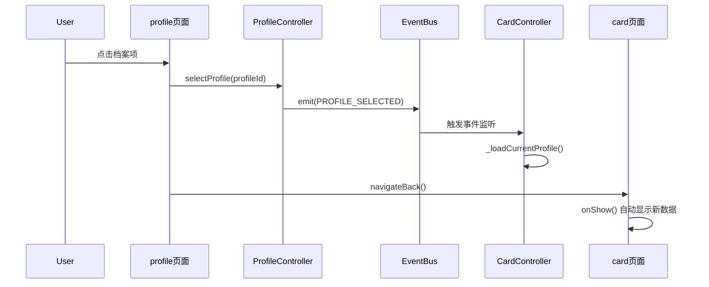

# Profile 页面从 Tab 页面改为独立页面后的导航调整

## 背景

profile 页面原来是 tab 页面，现在已经改为独立页面。需要检查和调整所有相关的导航逻辑。

## 当前状态

### app.json 配置

✅ **已正确调整**

```json
"tabBar": {
  "list": [
    { "pagePath": "pages/home/index", "text": "首页" },
    { "pagePath": "pages/card/index", "text": "卡牌" },
    { "pagePath": "pages/mine/index", "text": "我的" }
  ]
}
```

profile 页面**不在** tabBar 列表中，符合独立页面的定义。

### 跳转到 profile 的地方

所有跳转都已正确使用 `wx.navigateTo`：

1. **card/index.js (147行)** - onProfileEntryTap 方法
   ```javascript
   wx.navigateTo({
     url: '/pages/profile/index',
   });
   ```
   ✅ **正确**

2. **RegisterController.js (472行)** - 注册成功后跳转
   ```javascript
   // profile 不再是 tab 页面，使用 navigateTo
   wx.navigateTo({
     url: '/pages/profile/index',
   });
   ```
   ✅ **正确**（代码注释也说明了改动原因）

3. **addProfile/index.js** - goBack 方法中的降级方案
   - 使用了 redirectTo 和 navigateTo
   ✅ **正确**（复杂的智能返回逻辑）

## 需要修改的地方

### ❌ 问题1：profile 页面点击档案项的跳转逻辑

**位置**：`miniprogram/pages/profile/index.js` 第 87-102 行

**当前代码**：
```javascript
onProfileTap(e) {
  const profileId = e.currentTarget.dataset.id;
  this.controller.selectProfile(profileId);
  
  // 跳转到卡牌页面显示档案的八字卡牌
  // 由于 card 是 tab 页面，需要使用 switchTab
  wx.switchTab({
    url: '/pages/card/index',
    success: () => {
      log.debug('navigateToCard', '成功跳转到卡牌页面');
    },
    fail: (error) => {
      log.error('navigateToCard', '跳转失败', { error: error.errMsg });
    }
  });
},
```

**问题分析**：

1. **使用了 `wx.switchTab`**
   - switchTab 会**清空所有非 tab 页面的页面栈**
   - profile 页面会被清空，用户无法通过系统返回按钮回到 profile

2. **导航流程**：
   ```
   card (tab) -> navigateTo -> profile -> switchTab -> card (tab)
                    ↓                         ↓
              页面栈：[card, profile]    页面栈被清空：[card]
                                        profile 页面丢失！
   ```

3. **事件机制已存在**：
   - `controller.selectProfile()` 会触发 `PROFILE_EVENTS.PROFILE_SELECTED` 事件
   - `CardController` 监听这个事件并会自动重新加载数据
   - 所以不需要担心数据不刷新的问题

**修复方案**：

有两种场景需要考虑：

**场景A**：用户从 card 页面点击"牌库"按钮进入 profile
- 页面栈：`[card, profile]`
- 选择档案后应该：`navigateBack` 返回到 card
- 优点：保持页面栈完整，用户可以再次返回 profile

**场景B**：用户从其他地方（如外链、分享）直接进入 profile
- 页面栈：`[profile]` 或其他
- 选择档案后应该：`switchTab` 到 card（因为 card 是 tab 页面）
- 优点：确保能跳转到 card

**推荐方案**：智能判断页面栈

```javascript
onProfileTap(e) {
  const profileId = e.currentTarget.dataset.id;
  this.controller.selectProfile(profileId);
  
  // 智能判断如何跳转到 card 页面
  const pages = getCurrentPages();
  const cardPageIndex = pages.findIndex(p => p && p.route === 'pages/card/index');
  
  if (cardPageIndex >= 0 && cardPageIndex < pages.length - 1) {
    // 页面栈中有 card 页面，且不是当前页，使用 navigateBack 返回
    const delta = pages.length - 1 - cardPageIndex;
    log.debug('onProfileTap', `使用 navigateBack 返回到 card 页面，delta=${delta}`);
    
    wx.navigateBack({
      delta: delta,
      success: () => {
        log.debug('onProfileTap', '成功返回到 card 页面');
      },
      fail: (error) => {
        log.error('onProfileTap', 'navigateBack 失败，降级使用 switchTab', { error: error.errMsg });
        // 降级方案：使用 switchTab
        wx.switchTab({
          url: '/pages/card/index'
        });
      }
    });
  } else {
    // 页面栈中没有 card 页面，使用 switchTab 跳转
    log.debug('onProfileTap', '页面栈中没有 card，使用 switchTab 跳转');
    wx.switchTab({
      url: '/pages/card/index',
      success: () => {
        log.debug('onProfileTap', '成功跳转到 card 页面');
      },
      fail: (error) => {
        log.error('onProfileTap', '跳转失败', { error: error.errMsg });
      }
    });
  }
},
```

**或者简化方案**：总是使用 navigateBack

如果你确定 profile 页面**只会从 card 页面进入**，那么可以简化为：

```javascript
onProfileTap(e) {
  const profileId = e.currentTarget.dataset.id;
  this.controller.selectProfile(profileId);
  
  // profile 页面总是从 card 页面 navigateTo 进入，所以直接返回
  log.debug('onProfileTap', '选择档案后返回 card 页面');
  wx.navigateBack({
    success: () => {
      log.debug('onProfileTap', '成功返回到 card 页面');
    },
    fail: (error) => {
      log.error('onProfileTap', '返回失败，使用 switchTab', { error: error.errMsg });
      // 降级方案
      wx.switchTab({
        url: '/pages/card/index'
      });
    }
  });
},
```

### ✅ 其他地方检查结果

1. **addProfile 的 goBack 方法**
   - ✅ 已经实现了复杂的智能返回逻辑
   - ✅ 能正确处理各种页面栈情况
   - ✅ 不需要修改

2. **profile 页面配置**
   ```json
   {
     "usingComponents": {},
     "navigationBarTitleText": "牌库"
   }
   ```
   - ✅ 正确，使用了自定义的导航栏标题

3. **其他页面跳转到 profile**
   - ✅ 都使用了 navigateTo，正确

## 其他建议

### 1. 更新注释

**profile/index.js 第92行的注释**已过时：
```javascript
// 由于 card 是 tab 页面，需要使用 switchTab
```

应该更新为：
```javascript
// profile 现在是独立页面，从 card navigateTo 进入，选择档案后应该返回
```

### 2. 考虑用户体验

当前的导航流程：
```
card (查看卡牌) -> profile (选择档案) -> 返回 card (查看选中档案的卡牌)
```

这个流程很合理，使用 `navigateBack` 可以让用户：
- 如果需要，还能再次点击返回按钮回到 profile 页面
- 符合小程序的标准导航模式

### 3. 事件机制说明

选择档案后的数据刷新流程：



**关键点**：
- `selectProfile()` 会触发事件，CardController 会自动刷新数据
- 使用 `navigateBack` 返回时，card 页面的 `onShow()` 会被调用
- 数据已经在 CardController 中更新，页面显示时自动展示新数据

### 4. 测试场景

修改后需要测试以下场景：

1. ✅ **标准流程**：card -> profile -> 选择档案 -> 返回 card
   - 预期：返回到 card 页面，显示选中档案的卡牌
   - 预期：再次点击返回，能回到 profile 页面

2. ✅ **编辑档案后选择**：card -> profile -> 编辑档案 -> 返回 profile -> 选择档案 -> 返回 card
   - 预期：整个流程顺畅，数据正确

3. ✅ **多次切换档案**：在 profile 和 card 之间来回切换
   - 预期：每次都能正确显示数据

4. ✅ **异常情况**：如果 navigateBack 失败
   - 预期：降级使用 switchTab，确保能跳转到 card

## 总结

### 需要立即修改

❌ **profile/index.js 的 onProfileTap 方法**（第87-102行）
- 将 `switchTab` 改为智能的 `navigateBack`
- 添加降级方案

### 已经正确

✅ app.json 的 tabBar 配置
✅ 所有跳转到 profile 的地方都使用了 navigateTo
✅ addProfile 的返回逻辑
✅ 事件机制已经完善

### 改动影响

- **影响范围**：profile 页面选择档案后的跳转行为
- **用户体验提升**：用户可以在 profile 和 card 之间自由切换，不会丢失导航历史
- **风险**：低，因为有降级方案（navigateBack 失败时使用 switchTab）

