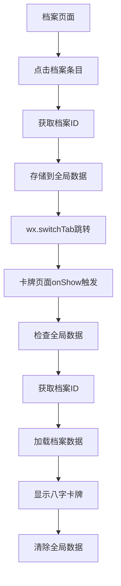

# TabBar页面跳转问题修复文档

## 问题描述
在档案页面点击档案条目时，无法正确跳转到卡牌页面并显示对应的档案信息。

## 问题原因
卡牌页面是TabBar页面，微信小程序的TabBar页面有以下限制：
1. **不能使用 `wx.navigateTo`**：TabBar页面只能通过 `wx.switchTab` 进行跳转
2. **不支持URL参数传递**：`wx.switchTab` 不支持在URL中传递参数
3. **页面生命周期差异**：TabBar切换时触发 `onShow` 而不是 `onLoad`

## 解决方案
采用**全局数据传递**的方式来解决TabBar页面参数传递问题。

### 1. 档案页面修改
**文件**: `pages/profile/index.js`

```javascript
onProfileTap(e) {
  const profileId = e.currentTarget.dataset.id;
  console.log('点击档案:', profileId);
  
  // 由于卡牌页面是TabBar页面，不能通过URL传参
  // 将档案ID存储到全局数据中
  const app = getApp();
  app.globalData.selectedProfileId = profileId;
  
  // 跳转到卡牌页面显示档案的八字卡牌
  wx.switchTab({
    url: '/pages/card/index'
  });
}
```

**修改要点**：
- ✅ 使用 `wx.switchTab` 替代 `wx.navigateTo`
- ✅ 将档案ID存储到全局数据 `app.globalData.selectedProfileId`
- ✅ 移除URL参数传递方式

### 2. 卡牌页面修改
**文件**: `pages/card/index.js`

#### 修改1: 参数处理逻辑
```javascript
handleReceivedParams(options) {
  const { profileId, datetime, hasCozeData } = options;
  
  // 如果有档案ID，优先加载档案数据
  if (profileId) {
    this.setData({ profileId });
    this.loadProfileData();
    return;
  }
  
  // 检查全局数据中是否有选中的档案ID（来自TabBar跳转）
  const app = getApp();
  const globalProfileId = app.globalData?.selectedProfileId;
  if (globalProfileId) {
    console.log('从全局数据获取档案ID:', globalProfileId);
    this.setData({ profileId: globalProfileId });
    this.loadProfileData();
    // 清除全局数据，避免重复使用
    app.globalData.selectedProfileId = null;
    return;
  }
  
  // 兼容原有的时间参数逻辑...
}
```

#### 修改2: onShow生命周期
```javascript
onShow() {
  // TabBar切换时检查全局数据中是否有选中的档案ID
  const app = getApp();
  const globalProfileId = app.globalData?.selectedProfileId;
  if (globalProfileId && globalProfileId !== this.data.profileId) {
    console.log('onShow: 从全局数据获取档案ID:', globalProfileId);
    this.setData({ profileId: globalProfileId });
    this.loadProfileData();
    // 清除全局数据，避免重复使用
    app.globalData.selectedProfileId = null;
  }
}
```

**修改要点**：
- ✅ 在 `handleReceivedParams` 中检查全局数据
- ✅ 在 `onShow` 中处理TabBar切换场景
- ✅ 使用后立即清除全局数据，避免重复使用
- ✅ 保持原有URL参数传递的兼容性

## 数据流程

### 完整的跳转流程


### 全局数据管理
```javascript
// 存储档案ID
app.globalData.selectedProfileId = profileId;

// 读取档案ID
const globalProfileId = app.globalData?.selectedProfileId;

// 清除档案ID（使用后立即清除）
app.globalData.selectedProfileId = null;
```

## 兼容性处理

### 1. 保持原有功能
- ✅ URL参数传递方式仍然有效（非TabBar跳转）
- ✅ 时间查询页面的跳转逻辑不受影响
- ✅ 全局八字数据的加载逻辑保持不变

### 2. 多种参数来源优先级
1. **URL参数** (`profileId` 参数) - 最高优先级
2. **全局数据** (`app.globalData.selectedProfileId`) - 中等优先级
3. **时间参数** (`datetime` 参数) - 较低优先级
4. **默认数据** - 最低优先级

## 测试验证

### 功能测试
- ✅ 档案页面点击档案条目能正确跳转到卡牌页面
- ✅ 卡牌页面能正确显示选中档案的信息
- ✅ 档案信息头部正确显示档案名称和时间
- ✅ 八字卡牌正确显示对应的图片和干支

### 兼容性测试
- ✅ 原有的时间查询跳转功能正常
- ✅ 全局八字数据加载功能正常
- ✅ 分享功能正常工作

### 边界情况测试
- ✅ 无效档案ID的处理
- ✅ 网络异常时的降级处理
- ✅ 重复点击档案的处理
- ✅ 全局数据的正确清理

## 技术特点

### 1. 全局数据管理
- **临时存储**：只在跳转过程中临时存储档案ID
- **自动清理**：使用后立即清除，避免数据污染
- **状态检查**：避免重复处理相同的档案ID

### 2. 生命周期处理
- **onLoad**：处理URL参数和初始化
- **onShow**：处理TabBar切换和全局数据
- **参数优先级**：合理的参数来源优先级处理

### 3. 错误处理
- **数据验证**：检查档案ID的有效性
- **网络异常**：友好的错误提示和降级处理
- **状态管理**：loading状态的正确管理

## 优势

1. **用户体验**：解决了TabBar页面无法传参的问题
2. **兼容性**：保持了原有功能的完整性
3. **可维护性**：清晰的数据流和错误处理
4. **性能**：避免了不必要的数据存储和内存泄漏

## 总结

通过使用全局数据传递的方式，成功解决了TabBar页面参数传递的限制问题，实现了从档案页面到卡牌页面的无缝跳转和数据展示。该方案既解决了当前问题，又保持了系统的兼容性和可扩展性。
