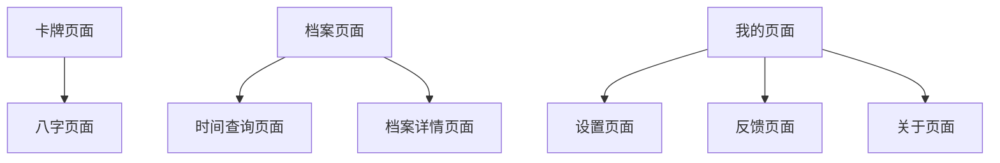

# TabBar页面功能说明

## 概述
小程序新增了底部TabBar导航，包含三个主要页面：卡牌、档案、我的。

## 页面结构

### 1. 卡牌页面 (`pages/card/index`)
- **功能**：展示各种功能卡牌，用户可以通过点击卡牌进入相应功能
- **特性**：
  - 卡牌列表展示
  - 支持下拉刷新
  - 空状态提示
  - 点击卡牌跳转到对应功能页面

### 2. 档案页面 (`pages/profile/index`)
- **功能**：管理用户的个人档案信息
- **特性**：
  - 用户信息头部展示
  - 档案列表管理
  - 支持添加新档案
  - 集成用户管理和档案管理云函数
  - 支持下拉刷新

### 3. 我的页面 (`pages/mine/index`)
- **功能**：个人中心，包含设置、反馈等功能入口
- **特性**：
  - 用户信息展示
  - 功能菜单列表
  - 版本信息显示
  - 支持分享功能

## TabBar配置

在 `app.json` 中配置了底部导航栏：
- **颜色主题**：未选中 #999999，选中 #667eea
- **背景色**：白色 #ffffff
- **三个Tab**：卡牌、档案、我的

## 页面跳转关系

## 注意事项

1. **首页设置**：卡牌页面现在是小程序的首页（pages数组第一个）
2. **用户管理**：档案和我的页面都集成了用户管理功能
3. **云函数依赖**：档案页面依赖 `profileManagement` 云函数
4. **图标支持**：当前使用纯文字TabBar，可后续添加图标
5. **组件依赖**：所有页面都使用TDesign组件库中已验证存在的组件

## 开发扩展

如需添加图标：
1. 在 `static/icons/` 目录下添加图标文件
2. 在 `app.json` 的 tabBar 配置中添加 `iconPath` 和 `selectedIconPath` 字段

建议图标规格：
- 尺寸：81px * 81px
- 格式：PNG
- 颜色：建议使用单色图标，系统会自动应用主题色
