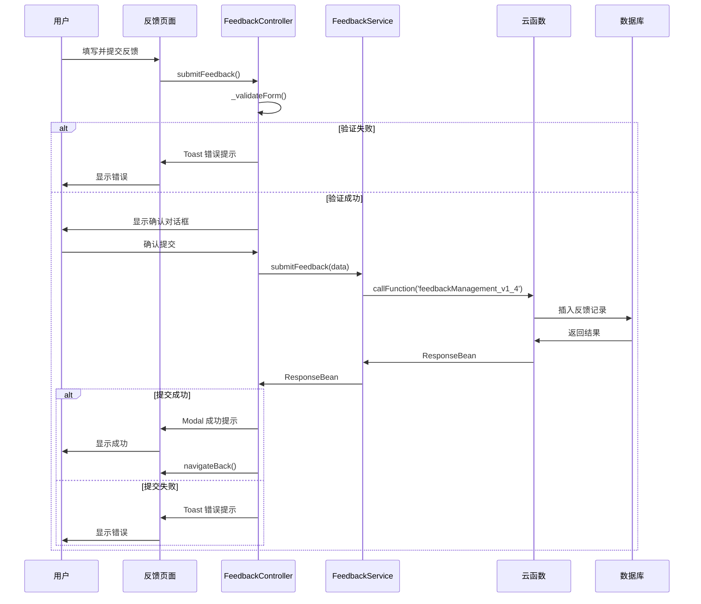

# 用户反馈功能前端实施总结

## 实施时间
2024年12月

## 实施内容

根据[用户反馈功能实现计划](./user-feedback-implementation-plan.md)的步骤6和步骤7，完成了用户反馈功能的前端实现。

## 创建的文件

### 1. 页面文件

#### 📁 miniprogram/pages/feedback/

```
miniprogram/pages/feedback/
├── index.js      # 页面逻辑
├── index.json    # 页面配置
├── index.wxml    # 页面结构
└── index.less    # 页面样式
```

**页面特性**：
- ✅ 反馈类型选择（问题反馈/功能建议/其他反馈）
- ✅ 标题输入（10-50字符，实时字数统计）
- ✅ 内容输入（20-500字符，实时字数统计）
- ✅ 表单验证和提交
- ✅ 加载状态和禁用处理

### 2. Service 层

#### 📄 miniprogram/services/FeedbackService.js

**功能方法**：
- `submitFeedback(feedbackData)` - 提交用户反馈
- `getUserFeedbacks(queryData)` - 获取用户反馈列表
- `getFeedbackDetail(feedbackId)` - 获取反馈详情

**特点**：
- ✅ 继承 BaseService
- ✅ 统一错误处理
- ✅ 完整的日志记录
- ✅ 自动版本管理（通过 VersionManager）
- ✅ ResponseBean 格式转换

### 3. Controller 层

#### 📄 miniprogram/controllers/FeedbackController.js

**核心方法**：
- `initialize()` - 初始化页面
- `selectFeedbackType(type)` - 选择反馈类型
- `onTitleInput(value)` - 标题输入处理
- `onContentInput(value)` - 内容输入处理
- `submitFeedback()` - 提交反馈（带验证）
- `_validateForm()` - 表单验证

**特点**：
- ✅ 完整的表单验证
- ✅ 用户交互确认
- ✅ 加载状态管理
- ✅ 成功后自动返回

### 4. 入口集成

#### 📄 miniprogram/pages/mine/index.wxml & index.js

在"我的"页面添加了反馈入口：
- ✅ 位置：使用手册下方
- ✅ 图标：💬（消息气泡）
- ✅ 标题：反馈与建议
- ✅ 描述：告诉我们您的想法

### 5. 配置更新

#### 📄 miniprogram/app.json
- ✅ 注册 `pages/feedback/index` 页面

#### 📄 miniprogram/services/README.md
- ✅ 更新 Service 层文档，添加 FeedbackService 说明

#### 📄 miniprogram/controllers/README.md
- ✅ 更新 Controller 层文档，添加 FeedbackController 说明

## 实现特点

### 1. 完整的表单验证

```javascript
// 验证规则
- 反馈类型：必选（problem/suggestion/other）
- 标题：10-50个字符
- 内容：20-500个字符
```

**验证时机**：
- ✅ 提交时验证所有字段
- ✅ 实时显示字数统计
- ✅ 超出长度自动限制输入

### 2. 友好的用户体验

**交互流程**：
1. 用户选择反馈类型
2. 输入标题和内容（实时显示字数）
3. 点击提交按钮
4. 显示确认对话框
5. 提交中显示 Loading
6. 成功后显示感谢提示
7. 自动返回上一页

**错误处理**：
- ✅ 参数验证错误：Toast 提示
- ✅ 网络错误：Toast 错误提示
- ✅ 云函数错误：显示具体错误信息

### 3. 视觉设计

**页面布局**：
- 白色卡片背景
- 清晰的分区标题
- 圆角卡片设计
- 蓝色主题色（选中状态）

**交互反馈**：
- 类型选择有选中效果
- 按钮有禁用状态
- 字数统计灰色显示
- 加载时按钮文字变化

## 技术实现

### 数据流

```
用户输入 → Page → Controller → Service → 云函数 → 数据库
   ↓         ↓         ↓           ↓          ↓          ↓
页面展示 ← setData ← 验证处理 ← ResponseBean ← 云函数返回 ← feedbacks
```

### 代码结构

```javascript
// 页面（轻量级）
Page({
  onLoad() {
    this.controller = new FeedbackController(this);
    this.controller.initialize();
  },
  onSubmit() {
    this.controller.submitFeedback();
  }
});

// Controller（业务逻辑）
class FeedbackController {
  async submitFeedback() {
    // 1. 验证表单
    // 2. 显示确认
    // 3. 调用 Service
    // 4. 处理结果
  }
}

// Service（数据层）
class FeedbackService extends BaseService {
  async submitFeedback(data) {
    // 1. 调用云函数
    // 2. 转换 ResponseBean
    // 3. 返回结果
  }
}
```

### 版本管理

```javascript
// 自动获取正确的云函数版本
const functionName = VersionManager.getFunctionName('feedbackManagement');
// 对于 v1.3.0 客户端，返回 'feedbackManagement_v1_4'
```

## 使用说明

### 1. 用户使用流程

1. **进入反馈页面**
   - 打开小程序
   - 点击"我的"标签
   - 点击"反馈与建议"卡片

2. **填写反馈**
   - 选择反馈类型（问题反馈/功能建议/其他反馈）
   - 输入标题（10-50字）
   - 输入详细内容（20-500字）

3. **提交反馈**
   - 点击"提交反馈"按钮
   - 确认提交
   - 等待提交完成
   - 查看成功提示

### 2. 错误提示说明

| 错误提示 | 原因 | 解决方法 |
|---------|------|---------|
| "请选择反馈类型" | 未选择反馈类型 | 选择一个反馈类型 |
| "请输入反馈标题" | 标题为空 | 输入标题内容 |
| "标题至少需要10个字符" | 标题太短 | 增加标题内容 |
| "标题不能超过50个字符" | 标题太长 | 减少标题内容 |
| "请输入反馈内容" | 内容为空 | 输入反馈内容 |
| "内容至少需要20个字符" | 内容太短 | 增加反馈内容 |
| "内容不能超过500个字符" | 内容太长 | 减少反馈内容 |

## 数据流转

### 提交反馈流程



## 文件依赖关系

```
pages/feedback/index.js
  ├── controllers/FeedbackController.js
  │     ├── services/FeedbackService.js
  │     │     ├── services/BaseService.js
  │     │     ├── beans/ResponseBean.js
  │     │     └── utils/manager/versionManager.js
  │     └── utils/logger/index.js
  └── utils/logger/index.js

pages/mine/index.js
  └── (添加反馈入口)
```

## 测试验证

### 功能测试清单

- [ ] 页面正常打开
- [ ] 反馈类型选择切换正常
- [ ] 标题输入和字数统计正常
- [ ] 内容输入和字数统计正常
- [ ] 表单验证提示正常
- [ ] 确认对话框正常显示
- [ ] 提交加载状态正常
- [ ] 提交成功后正常返回
- [ ] 错误提示正常显示
- [ ] 从"我的"页面入口正常跳转

### 边界测试

- [ ] 标题输入9个字符（应提示错误）
- [ ] 标题输入10个字符（应允许提交）
- [ ] 标题输入50个字符（应允许提交）
- [ ] 标题输入51个字符（应限制输入）
- [ ] 内容输入19个字符（应提示错误）
- [ ] 内容输入20个字符（应允许提交）
- [ ] 内容输入500个字符（应允许提交）
- [ ] 内容输入501个字符（应限制输入）

## 后续优化建议

### 短期优化
1. **反馈历史查看**
   - 添加"我的反馈"页面
   - 查看已提交的反馈
   - 查看处理状态和回复

2. **图片上传**
   - 支持截图上传
   - 最多3张图片
   - 自动压缩图片

3. **快捷反馈**
   - 预设常见问题模板
   - 一键填充标题和内容

### 中期优化
1. **反馈推送通知**
   - 管理员回复后推送通知
   - 反馈处理完成推送

2. **反馈评分**
   - 用户对处理结果评分
   - 满意度统计

### 长期优化
1. **智能反馈分类**
   - AI 自动分析反馈类型
   - 智能推荐相似问题

2. **反馈社区**
   - 查看其他用户反馈
   - 对他人反馈点赞

## 相关文档

- [用户反馈功能设计](./user-feedback-feature-design.md)
- [用户反馈功能实现计划](./user-feedback-implementation-plan.md)
- [云函数实施总结](./user-feedback-cloud-function-implementation.md)
- [API 接口文档](./api/feedbackManagementAPI.md)
- [数据库文档](./database/feedbacksdb.md)

## 总结

本次实施完成了用户反馈功能的前端部分，包括：

### ✅ 已完成
- 反馈提交页面（完整功能）
- FeedbackService 服务层
- FeedbackController 控制器层
- "我的"页面入口集成
- 完整的表单验证
- 友好的用户体验
- 详细的文档更新

### 📦 文件统计
- **新增页面**：1个（feedback）
- **新增 Service**：1个（FeedbackService）
- **新增 Controller**：1个（FeedbackController）
- **修改页面**：1个（mine，添加入口）
- **更新文档**：2个（services/README.md, controllers/README.md）

### 🎯 实现质量
- ✅ 代码无 linter 错误
- ✅ 遵循项目架构规范
- ✅ 完整的错误处理
- ✅ 详细的代码注释
- ✅ 统一的日志记录

用户反馈功能的前端部分已完全实现，可以进行测试和使用。需要先部署云函数 `feedbackManagement_v1_4` 到云端，然后即可正常使用反馈功能。

---

*文档创建时间: 2024年12月*
*实施人员: AI Assistant*

